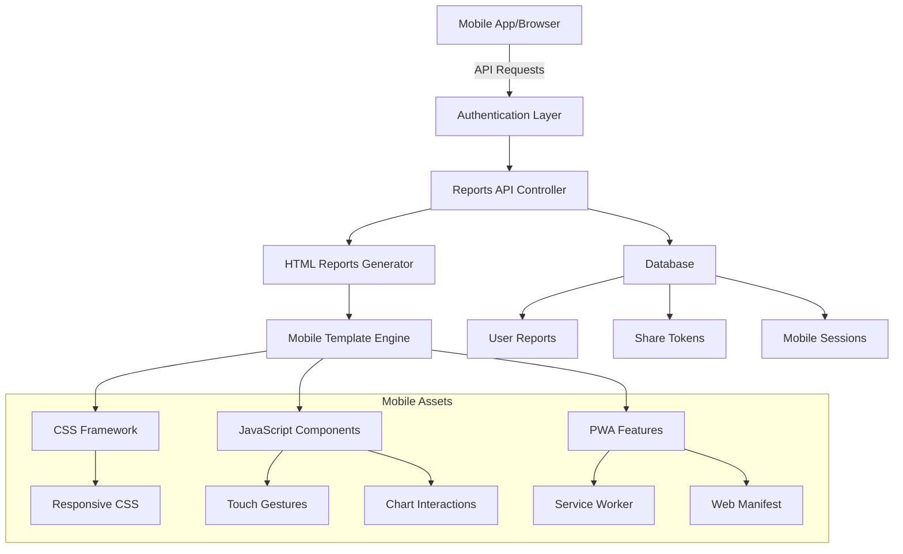
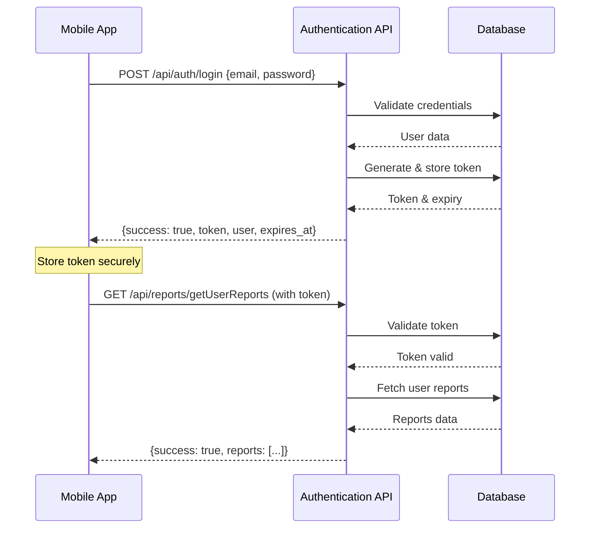

# Modern Agent Mobile App Development - Comprehensive Guide

## Table of Contents

1. [Overview](#overview)
2. [Architecture](#architecture)
3. [Mobile HTML Reports System](#mobile-html-reports-system)
4. [FlutterFlow Mobile App](#flutterflow-mobile-app)
5. [API Integration](#api-integration)
6. [Database Schema](#database-schema)
7. [Development Workflow](#development-workflow)
8. [Testing Strategy](#testing-strategy)
9. [Deployment Guidelines](#deployment-guidelines)
10. [Performance Optimization](#performance-optimization)
11. [Security Considerations](#security-considerations)
12. [Troubleshooting](#troubleshooting)

---

## Overview

The Modern Agent mobile ecosystem consists of two primary components:

1. **Mobile-Optimized HTML Reports**: Progressive Web App (PWA) for viewing real estate reports
2. **FlutterFlow Native Mobile App**: Full-featured mobile application for report management

This dual approach provides both immediate mobile access through browsers and a native app experience for power users.

### Key Features

- 📱 **Responsive Design**: Optimized for all screen sizes
- 🎯 **Touch Navigation**: Intuitive swipe and tap interactions
- 📊 **Interactive Charts**: Chart.js powered visualizations
- 🔄 **Offline Support**: PWA capabilities for offline viewing
- 🔐 **Secure Authentication**: Token-based API security
- 📤 **Easy Sharing**: Token-based report sharing
- 🎨 **Custom Theming**: Configurable brand colors

---

## Architecture

### System Overview



### Component Hierarchy

```
Modern Agent Mobile System
├── Backend API Layer
│   ├── Authentication API (/api/auth/)
│   ├── Reports Management API (/api/reports/)
│   └── HTML Reports API (/api/htmlReports/)
├── Mobile HTML Reports (PWA)
│   ├── Template System
│   ├── CSS Framework
│   ├── JavaScript Engine
│   └── PWA Components
└── FlutterFlow Native App
    ├── Authentication Module
    ├── Report Listing Module
    ├── Report Viewer Module
    └── Settings Module
```

---

## Mobile HTML Reports System

### 1. Template Structure

#### Main Template (`application/views/reports/mobile/report_template.php`)

The main template serves as the container for all mobile report components:

```php
<!DOCTYPE html>
<html lang="en">
<head>
    <!-- PWA Meta Tags -->
    <meta name="viewport" content="width=device-width, initial-scale=1.0, user-scalable=yes, maximum-scale=3.0">
    <meta name="theme-color" content="<?php echo $theme; ?>">
    <meta name="apple-mobile-web-app-capable" content="yes">
    
    <!-- CSS Framework -->
    <link rel="stylesheet" href="<?php echo base_url('assets/reports/mobile/css/mobile.css'); ?>">
    
    <!-- External Libraries -->
    <script src="https://cdn.jsdelivr.net/npm/chart.js"></script>
    <script src="https://cdn.jsdelivr.net/npm/hammerjs@2.0.8"></script>
    
    <!-- PWA Manifest -->
    <link rel="manifest" href="<?php echo base_url('assets/reports/mobile/manifest.json'); ?>">
    
    <!-- Dynamic Theming -->
    <style>
        :root {
            --theme-color: <?php echo $theme; ?>;
            --theme-color-light: <?php echo $theme; ?>20;
            --theme-color-dark: <?php echo $theme; ?>CC;
        }
    </style>
</head>
<body>
    <div id="loading-screen">
        <div class="loading-spinner"></div>
        <p>Loading Report...</p>
    </div>
    
    <div id="mobile-report" style="display: none;">
        <?php $this->load->view('reports/mobile/components/header', $data); ?>
        <?php $this->load->view('reports/mobile/components/navigation', $data); ?>
        
        <div class="report-content">
            <section id="overview" class="content-section active">
                <?php $this->load->view('reports/mobile/components/property_overview', $data); ?>
            </section>
            
            <section id="comparables" class="content-section">
                <?php $this->load->view('reports/mobile/components/comparable_sales', $data); ?>
            </section>
            
            <section id="insights" class="content-section">
                <?php $this->load->view('reports/mobile/components/ai_insights', $data); ?>
            </section>
            
            <section id="details" class="content-section">
                <?php $this->load->view('reports/mobile/components/property_details', $data); ?>
            </section>
        </div>
        
        <?php $this->load->view('reports/mobile/components/footer', $data); ?>
    </div>
    
    <!-- JavaScript Engine -->
    <script src="<?php echo base_url('assets/reports/mobile/js/mobile-report.js'); ?>"></script>
    
    <!-- PWA Service Worker -->
    <script>
        if ('serviceWorker' in navigator) {
            navigator.serviceWorker.register('<?php echo base_url('assets/reports/mobile/sw.js'); ?>');
        }
    </script>
</body>
</html>
```

#### Component Templates

Each component is modular and self-contained:

**Property Overview** (`components/property_overview.php`):
```php
<div class="property-overview">
    <div class="hero-image">
        " alt="<?php echo $property_address; ?>">
        <div class="property-price">$<?php echo number_format($property_price); ?></div>
    </div>
    
    <div class="property-details-grid">
        <div class="detail-item">
            <span class="detail-value"><?php echo $bedrooms; ?></span>
            <span class="detail-label">Beds</span>
        </div>
        <div class="detail-item">
            <span class="detail-value"><?php echo $bathrooms; ?></span>
            <span class="detail-label">Baths</span>
        </div>
        <div class="detail-item">
            <span class="detail-value"><?php echo number_format($square_feet); ?></span>
            <span class="detail-label">Sq Ft</span>
        </div>
        <div class="detail-item">
            <span class="detail-value"><?php echo $year_built; ?></span>
            <span class="detail-label">Built</span>
        </div>
    </div>
    
    <div class="map-container">
        " alt="Property Location" class="map-image">
        <button class="map-fullscreen-btn" onclick="openFullscreenMap()">
            <i class="icon-fullscreen"></i>
        </button>
    </div>
</div>
```

### 2. CSS Framework (`assets/reports/mobile/css/mobile.css`)

#### Core Features

- **CSS Custom Properties**: Dynamic theming support
- **Flexbox/Grid Layouts**: Modern responsive design
- **Touch-Friendly Elements**: 44px minimum touch targets
- **Smooth Animations**: 60fps transitions
- **Dark Mode Support**: Automatic theme switching

#### Key CSS Structure

```css
/* CSS Variables for Dynamic Theming */
:root {
    --theme-color: #007bff;
    --theme-color-light: rgba(0, 123, 255, 0.1);
    --theme-color-dark: rgba(0, 123, 255, 0.8);
    --text-primary: #333;
    --text-secondary: #666;
    --background-primary: #ffffff;
    --background-secondary: #f8f9fa;
    --border-color: #dee2e6;
    --shadow-light: 0 2px 4px rgba(0,0,0,0.1);
    --shadow-medium: 0 4px 8px rgba(0,0,0,0.15);
}

/* Dark Mode Variables */
@media (prefers-color-scheme: dark) {
    :root {
        --text-primary: #ffffff;
        --text-secondary: #cccccc;
        --background-primary: #1a1a1a;
        --background-secondary: #2a2a2a;
        --border-color: #444444;
    }
}

/* Responsive Base */
* {
    box-sizing: border-box;
}

body {
    margin: 0;
    padding: 0;
    font-family: -apple-system, BlinkMacSystemFont, 'Segoe UI', Roboto, sans-serif;
    background-color: var(--background-primary);
    color: var(--text-primary);
    line-height: 1.6;
}

/* Touch-Friendly Navigation */
.nav-tabs {
    display: flex;
    background: var(--background-secondary);
    border-bottom: 1px solid var(--border-color);
    overflow-x: auto;
    -webkit-overflow-scrolling: touch;
}

.nav-tab {
    flex: 1;
    min-width: 80px;
    padding: 12px 8px;
    text-align: center;
    border: none;
    background: transparent;
    color: var(--text-secondary);
    font-size: 14px;
    cursor: pointer;
    transition: all 0.3s ease;
    min-height: 44px; /* Touch target minimum */
}

.nav-tab.active {
    color: var(--theme-color);
    border-bottom: 2px solid var(--theme-color);
    background: var(--background-primary);
}

/* Chart Containers */
.chart-container {
    position: relative;
    height: 300px;
    margin: 20px 0;
    background: var(--background-primary);
    border-radius: 8px;
    padding: 15px;
    box-shadow: var(--shadow-light);
}

/* Responsive Breakpoints */
@media (max-width: 768px) {
    .property-details-grid {
        grid-template-columns: repeat(2, 1fr);
        gap: 10px;
    }
    
    .chart-container {
        height: 250px;
        padding: 10px;
    }
}

@media (max-width: 480px) {
    .nav-tab {
        font-size: 12px;
        padding: 10px 4px;
    }
    
    .property-details-grid {
        grid-template-columns: repeat(2, 1fr);
        gap: 8px;
    }
}
```

### 3. JavaScript Engine (`assets/reports/mobile/js/mobile-report.js`)

#### Core Class Structure

```javascript
class MobileReport {
    constructor() {
        this.currentSection = 'overview';
        this.charts = {};
        this.touchStartX = 0;
        this.touchStartY = 0;
        this.isScrolling = false;
    }

    init() {
        this.setupNavigation();
        this.setupTouchGestures();
        this.initializeCharts();
        this.setupPWA();
        this.hideLoadingScreen();
    }

    setupNavigation() {
        const tabs = document.querySelectorAll('.nav-tab');
        tabs.forEach(tab => {
            tab.addEventListener('click', (e) => {
                e.preventDefault();
                const sectionId = tab.getAttribute('data-section');
                this.showSection(sectionId);
            });
        });
    }

    showSection(sectionId) {
        // Hide all sections
        document.querySelectorAll('.content-section').forEach(section => {
            section.classList.remove('active');
        });
        
        // Show target section
        const targetSection = document.getElementById(sectionId);
        if (targetSection) {
            targetSection.classList.add('active');
            this.currentSection = sectionId;
        }
        
        // Update navigation
        document.querySelectorAll('.nav-tab').forEach(tab => {
            tab.classList.remove('active');
        });
        
        const activeTab = document.querySelector(`[data-section="${sectionId}"]`);
        if (activeTab) {
            activeTab.classList.add('active');
        }
        
        // Scroll to top
        window.scrollTo(0, 0);
        
        // Refresh charts if needed
        this.refreshChartsInSection(sectionId);
    }

    setupTouchGestures() {
        const reportContainer = document.getElementById('mobile-report');
        const hammer = new Hammer(reportContainer);
        
        // Enable swipe gestures
        hammer.get('swipe').set({ direction: Hammer.DIRECTION_HORIZONTAL });
        
        hammer.on('swipeleft', () => {
            this.navigateToNext();
        });
        
        hammer.on('swiperight', () => {
            this.navigateToPrevious();
        });
        
        // Chart pinch-to-zoom
        const chartContainers = document.querySelectorAll('.chart-container');
        chartContainers.forEach(container => {
            const hammerChart = new Hammer(container);
            hammerChart.get('pinch').set({ enable: true });
            
            hammerChart.on('pinchstart pinchend', (ev) => {
                container.style.transform = `scale(${ev.scale})`;
            });
        });
    }

    initializeCharts() {
        // Price Comparison Chart
        this.initPriceComparisonChart();
        
        // Price per Sq Ft Chart
        this.initPricePerSqftChart();
        
        // Market Trends Chart (if data available)
        this.initMarketTrendsChart();
    }

    initPriceComparisonChart() {
        const ctx = document.getElementById('priceComparisonChart');
        if (!ctx) return;
        
        this.charts.priceComparison = new Chart(ctx, {
            type: 'bar',
            data: {
                labels: window.comparableData.map(c => c.address),
                datasets: [{
                    label: 'Sale Price',
                    data: window.comparableData.map(c => c.price),
                    backgroundColor: getComputedStyle(document.documentElement)
                        .getPropertyValue('--theme-color'),
                    borderRadius: 4
                }]
            },
            options: {
                responsive: true,
                maintainAspectRatio: false,
                plugins: {
                    legend: {
                        display: false
                    }
                },
                scales: {
                    y: {
                        beginAtZero: true,
                        ticks: {
                            callback: function(value) {
                                return '$' + value.toLocaleString();
                            }
                        }
                    },
                    x: {
                        ticks: {
                            maxRotation: 45,
                            font: {
                                size: 10
                            }
                        }
                    }
                },
                onClick: (event, elements) => {
                    if (elements.length > 0) {
                        const index = elements[0].index;
                        highlightComparable(index);
                    }
                }
            }
        });
    }

    setupPWA() {
        // Register service worker
        if ('serviceWorker' in navigator) {
            navigator.serviceWorker.register('/assets/reports/mobile/sw.js')
                .then(registration => {
                    console.log('SW registered: ', registration);
                })
                .catch(registrationError => {
                    console.log('SW registration failed: ', registrationError);
                });
        }
        
        // Handle install prompt
        let deferredPrompt;
        window.addEventListener('beforeinstallprompt', (e) => {
            e.preventDefault();
            deferredPrompt = e;
            this.showInstallButton();
        });
        
        // Handle app installation
        document.getElementById('install-btn')?.addEventListener('click', async () => {
            if (deferredPrompt) {
                deferredPrompt.prompt();
                const { outcome } = await deferredPrompt.userChoice;
                deferredPrompt = null;
                this.hideInstallButton();
            }
        });
    }
}

// Global Functions
function openFullscreenMap() {
    const mapImage = document.querySelector('.map-image');
    if (mapImage.requestFullscreen) {
        mapImage.requestFullscreen();
    }
}

function highlightComparable(index) {
    document.querySelectorAll('.comparable-card').forEach((card, i) => {
        if (i === index) {
            card.classList.add('highlighted');
            card.scrollIntoView({ behavior: 'smooth', block: 'center' });
        } else {
            card.classList.remove('highlighted');
        }
    });
}

// Initialize on DOM ready
document.addEventListener('DOMContentLoaded', () => {
    const mobileReport = new MobileReport();
    mobileReport.init();
});
```

### 4. PWA Components

#### Service Worker (`assets/reports/mobile/sw.js`)

```javascript
const CACHE_NAME = 'modern-agent-reports-v1';
const urlsToCache = [
    '/',
    '/assets/reports/mobile/css/mobile.css',
    '/assets/reports/mobile/js/mobile-report.js',
    '/assets/reports/mobile/manifest.json',
    'https://cdn.jsdelivr.net/npm/chart.js',
    'https://cdn.jsdelivr.net/npm/hammerjs@2.0.8'
];

self.addEventListener('install', (event) => {
    event.waitUntil(
        caches.open(CACHE_NAME)
            .then((cache) => cache.addAll(urlsToCache))
    );
});

self.addEventListener('fetch', (event) => {
    event.respondWith(
        caches.match(event.request)
            .then((response) => {
                if (response) {
                    return response;
                }
                return fetch(event.request);
            }
        )
    );
});

self.addEventListener('activate', (event) => {
    event.waitUntil(
        caches.keys().then((cacheNames) => {
            return Promise.all(
                cacheNames.map((cacheName) => {
                    if (cacheName !== CACHE_NAME) {
                        return caches.delete(cacheName);
                    }
                })
            );
        })
    );
});
```

#### Web App Manifest (`assets/reports/mobile/manifest.json`)

```json
{
    "name": "Modern Agent Report",
    "short_name": "MA Report",
    "description": "Interactive Real Estate Property Report",
    "start_url": "./index.html",
    "display": "standalone",
    "background_color": "#007bff",
    "theme_color": "#007bff",
    "orientation": "portrait-primary",
    "categories": ["business", "productivity"],
    "icons": [
        {
            "src": "icons/icon-72x72.png",
            "sizes": "72x72",
            "type": "image/png"
        },
        {
            "src": "icons/icon-96x96.png",
            "sizes": "96x96",
            "type": "image/png"
        },
        {
            "src": "icons/icon-128x128.png",
            "sizes": "128x128",
            "type": "image/png"
        },
        {
            "src": "icons/icon-144x144.png",
            "sizes": "144x144",
            "type": "image/png"
        },
        {
            "src": "icons/icon-152x152.png",
            "sizes": "152x152",
            "type": "image/png"
        },
        {
            "src": "icons/icon-192x192.png",
            "sizes": "192x192",
            "type": "image/png"
        },
        {
            "src": "icons/icon-384x384.png",
            "sizes": "384x384",
            "type": "image/png"
        },
        {
            "src": "icons/icon-512x512.png",
            "sizes": "512x512",
            "type": "image/png"
        }
    ]
}
```

---

## FlutterFlow Mobile App

### 1. App Architecture

The FlutterFlow app follows a modular architecture with clear separation of concerns:

```
FlutterFlow App Structure
├── Authentication Module
│   ├── Login Screen
│   ├── Token Management
│   └── Biometric Authentication
├── Dashboard Module
│   ├── Reports List
│   ├── Search & Filter
│   └── Quick Actions
├── Report Viewer Module
│   ├── HTML Report WebView
│   ├── Share Functionality
│   └── Offline Storage
├── Settings Module
│   ├── Profile Management
│   ├── Preferences
│   └── About/Help
└── Shared Components
    ├── API Service
    ├── Storage Service
    └── Navigation Service
```

### 2. Screen Specifications

#### Login Screen
- **Purpose**: Authenticate users and obtain API token
- **Components**:
  - Email input field
  - Password input field
  - Login button
  - "Remember me" toggle
  - Forgot password link
  - Biometric login option (if available)

#### Dashboard Screen
- **Purpose**: Display list of user reports with search/filter
- **Components**:
  - Search bar
  - Filter options (date, type, status)
  - Reports list (infinite scroll)
  - Floating action button for new report
  - Pull-to-refresh functionality

#### Report Viewer Screen
- **Purpose**: Display mobile-optimized HTML report
- **Components**:
  - WebView container for HTML report
  - Share button
  - Download/Save button
  - Full-screen toggle
  - Navigation controls

### 3. API Integration Points

#### Authentication Endpoints
```dart
// Login
POST /api/auth/login
Body: {"email": "user@example.com", "password": "password"}
Response: {"success": true, "data": {"token": "...", "user": {...}}}

// Token Refresh
POST /api/auth/refreshToken
Headers: Authorization: Bearer {token}
Response: {"success": true, "data": {"token": "...", "expires_at": "..."}}

// Logout
POST /api/auth/logout
Headers: Authorization: Bearer {token}
Response: {"success": true, "message": "Logged out successfully"}
```

#### Reports Endpoints
```dart
// Get User Reports
GET /api/reports/getUserReports?page=1&limit=20&search=&type=
Headers: Authorization: Bearer {token}
Response: {"success": true, "data": {"reports": [...], "pagination": {...}}}

// Get Report Details
GET /api/reports/getReportDetails/{reportId}
Headers: Authorization: Bearer {token}
Response: {"success": true, "data": {"report": {...}}}

// Generate Share Token
POST /api/reports/generateShareToken/{reportId}
Headers: Authorization: Bearer {token}
Response: {"success": true, "data": {"share_token": "...", "expires_at": "..."}}
```

#### HTML Reports Endpoints
```dart
// Get Mobile HTML Report
GET /api/htmlReports/getHtmlReport/{reportId}
Headers: Authorization: Bearer {token}
Response: HTML content or {"success": true, "data": {"html_url": "..."}}

// Access Shared Report
GET /api/htmlReports/shareHtmlReport/{shareToken}
Response: HTML content
```

### 4. Data Models

#### User Model
```dart
class User {
  final int userId;
  final String firstName;
  final String lastName;
  final String email;
  final String companyName;
  final String profileImage;
  final String phone;
  final String title;
  
  User({
    required this.userId,
    required this.firstName,
    required this.lastName,
    required this.email,
    this.companyName = '',
    this.profileImage = '',
    this.phone = '',
    this.title = '',
  });
  
  factory User.fromJson(Map<String, dynamic> json) {
    return User(
      userId: json['user_id_pk'],
      firstName: json['first_name'],
      lastName: json['last_name'],
      email: json['email'],
      companyName: json['company_name'] ?? '',
      profileImage: json['profile_image'] ?? '',
      phone: json['phone'] ?? '',
      title: json['title'] ?? '',
    );
  }
}
```

#### Report Model
```dart
class Report {
  final int reportId;
  final String projectName;
  final String propertyAddress;
  final String propertyOwner;
  final String reportType;
  final DateTime projectDate;
  final String reportPath;
  final bool hasHtmlVersion;
  final bool isMobileOptimized;
  final bool isPublic;
  final String? shareToken;
  final DateTime? shareExpiry;
  final String themeColor;
  
  Report({
    required this.reportId,
    required this.projectName,
    required this.propertyAddress,
    required this.propertyOwner,
    required this.reportType,
    required this.projectDate,
    required this.reportPath,
    this.hasHtmlVersion = false,
    this.isMobileOptimized = false,
    this.isPublic = false,
    this.shareToken,
    this.shareExpiry,
    this.themeColor = '#007bff',
  });
  
  factory Report.fromJson(Map<String, dynamic> json) {
    return Report(
      reportId: json['project_id_pk'],
      projectName: json['project_name'],
      propertyAddress: json['property_address'],
      propertyOwner: json['property_owner'],
      reportType: json['report_type'],
      projectDate: DateTime.parse(json['project_date']),
      reportPath: json['report_path'],
      hasHtmlVersion: json['html_version'] != null,
      isMobileOptimized: json['mobile_optimized'] == 1,
      isPublic: json['is_public'] == 1,
      shareToken: json['share_token'],
      shareExpiry: json['share_expiry'] != null 
          ? DateTime.parse(json['share_expiry']) 
          : null,
      themeColor: json['theme_color'] ?? '#007bff',
    );
  }
}
```

### 5. State Management

Using FlutterFlow's built-in state management with custom actions:

#### App State
```dart
class AppState {
  User? currentUser;
  String? authToken;
  DateTime? tokenExpiry;
  List<Report> reports = [];
  bool isLoading = false;
  String? errorMessage;
  
  // Authentication state
  bool get isAuthenticated => 
      authToken != null && 
      tokenExpiry != null && 
      tokenExpiry!.isAfter(DateTime.now());
      
  // Update methods
  void setUser(User user, String token, DateTime expiry) {
    currentUser = user;
    authToken = token;
    tokenExpiry = expiry;
  }
  
  void clearUser() {
    currentUser = null;
    authToken = null;
    tokenExpiry = null;
    reports.clear();
  }
  
  void setReports(List<Report> newReports) {
    reports = newReports;
  }
  
  void addReport(Report report) {
    reports.insert(0, report);
  }
}
```

---

## API Integration

### 1. Authentication Flow



### 2. Error Handling

#### Standard Error Response Format
```json
{
    "success": false,
    "message": "Error description",
    "error_code": "ERROR_CODE",
    "details": {
        "field": "error message"
    }
}
```

#### Common Error Codes
- `INVALID_CREDENTIALS`: Wrong email or password
- `TOKEN_EXPIRED`: Authentication token has expired
- `TOKEN_INVALID`: Authentication token is invalid
- `ACCESS_DENIED`: User doesn't have permission
- `REPORT_NOT_FOUND`: Requested report doesn't exist
- `VALIDATION_ERROR`: Input validation failed
- `SERVER_ERROR`: Internal server error

### 3. API Client Implementation

```dart
class ApiClient {
  static const String baseUrl = 'https://yourapp.com';
  final Dio _dio = Dio();
  
  ApiClient() {
    _dio.interceptors.add(InterceptorsWrapper(
      onRequest: (options, handler) {
        // Add auth token to requests
        final token = AppState.instance.authToken;
        if (token != null) {
          options.headers['Authorization'] = 'Bearer $token';
        }
        handler.next(options);
      },
      onError: (error, handler) {
        // Handle token expiry
        if (error.response?.statusCode == 401) {
          AppState.instance.clearUser();
          // Navigate to login
        }
        handler.next(error);
      },
    ));
  }
  
  Future<ApiResponse<User>> login(String email, String password) async {
    try {
      final response = await _dio.post(
        '$baseUrl/api/auth/login',
        data: {'email': email, 'password': password},
      );
      
      if (response.data['success']) {
        final user = User.fromJson(response.data['data']['user']);
        return ApiResponse.success(user, response.data['data']);
      } else {
        return ApiResponse.error(response.data['message']);
      }
    } catch (e) {
      return ApiResponse.error('Network error: $e');
    }
  }
  
  Future<ApiResponse<List<Report>>> getReports({
    int page = 1,
    int limit = 20,
    String search = '',
    String type = '',
  }) async {
    try {
      final response = await _dio.get(
        '$baseUrl/api/reports/getUserReports',
        queryParameters: {
          'page': page,
          'limit': limit,
          'search': search,
          'type': type,
        },
      );
      
      if (response.data['success']) {
        final reports = (response.data['data']['reports'] as List)
            .map((json) => Report.fromJson(json))
            .toList();
        return ApiResponse.success(reports, response.data['data']);
      } else {
        return ApiResponse.error(response.data['message']);
      }
    } catch (e) {
      return ApiResponse.error('Network error: $e');
    }
  }
}

class ApiResponse<T> {
  final bool success;
  final T? data;
  final String? error;
  final Map<String, dynamic>? metadata;
  
  ApiResponse.success(this.data, this.metadata) : 
      success = true, error = null;
      
  ApiResponse.error(this.error) : 
      success = false, data = null, metadata = null;
}
```

---

## Database Schema

### Updated Tables

#### 1. lp_user_mst (Enhanced)
```sql
-- New columns added for mobile support
ALTER TABLE lp_user_mst ADD COLUMN api_token VARCHAR(64) NULL COMMENT 'API authentication token';
ALTER TABLE lp_user_mst ADD COLUMN token_expiry DATETIME NULL COMMENT 'API token expiration';
ALTER TABLE lp_user_mst ADD COLUMN pwa_enabled TINYINT(1) DEFAULT 1 COMMENT 'PWA features enabled';
ALTER TABLE lp_user_mst ADD COLUMN offline_reports TINYINT(1) DEFAULT 0 COMMENT 'Offline report access';

-- Indexes for performance
CREATE INDEX idx_api_token ON lp_user_mst(api_token);
CREATE INDEX idx_token_expiry ON lp_user_mst(token_expiry);
```

#### 2. lp_my_listing (Enhanced)
```sql
-- New columns for mobile/sharing features
ALTER TABLE lp_my_listing ADD COLUMN share_token VARCHAR(64) NULL COMMENT 'Public sharing token';
ALTER TABLE lp_my_listing ADD COLUMN share_expiry DATETIME NULL COMMENT 'Share token expiration';
ALTER TABLE lp_my_listing ADD COLUMN is_public TINYINT(1) DEFAULT 0 COMMENT 'Public access enabled';
ALTER TABLE lp_my_listing ADD COLUMN html_version TEXT NULL COMMENT 'Mobile HTML report path';
ALTER TABLE lp_my_listing ADD COLUMN html_generated_at DATETIME NULL COMMENT 'HTML generation timestamp';
ALTER TABLE lp_my_listing ADD COLUMN mobile_optimized TINYINT(1) DEFAULT 0 COMMENT 'Mobile optimization status';
ALTER TABLE lp_my_listing ADD COLUMN interactive_charts TINYINT(1) DEFAULT 1 COMMENT 'Interactive charts enabled';
ALTER TABLE lp_my_listing ADD COLUMN theme_color VARCHAR(7) DEFAULT '#007bff' COMMENT 'Report theme color';

-- Indexes
CREATE INDEX idx_share_token ON lp_my_listing(share_token);
CREATE INDEX idx_html_version ON lp_my_listing(html_version(50));
CREATE INDEX idx_mobile_optimized ON lp_my_listing(mobile_optimized);
```

#### 3. lp_mobile_sessions (New Table)
```sql
CREATE TABLE lp_mobile_sessions (
    session_id VARCHAR(64) PRIMARY KEY COMMENT 'Unique session identifier',
    user_id_fk INT NULL COMMENT 'Foreign key to lp_user_mst.user_id_pk',
    report_id_fk INT NULL COMMENT 'Foreign key to lp_my_listing.project_id_pk',
    device_type VARCHAR(50) NULL COMMENT 'Device type (iOS, Android, Web)',
    device_info TEXT NULL COMMENT 'Device information JSON',
    session_start DATETIME DEFAULT CURRENT_TIMESTAMP COMMENT 'Session start time',
    session_end DATETIME NULL COMMENT 'Session end time',
    actions_count INT DEFAULT 0 COMMENT 'Number of actions in session',
    created_at DATETIME DEFAULT CURRENT_TIMESTAMP,
    updated_at DATETIME DEFAULT CURRENT_TIMESTAMP ON UPDATE CURRENT_TIMESTAMP,
    
    FOREIGN KEY (user_id_fk) REFERENCES lp_user_mst(user_id_pk) ON DELETE CASCADE,
    FOREIGN KEY (report_id_fk) REFERENCES lp_my_listing(project_id_pk) ON DELETE CASCADE,
    
    INDEX idx_user_sessions (user_id_fk, session_start),
    INDEX idx_report_sessions (report_id_fk, session_start),
    INDEX idx_session_start (session_start)
) ENGINE=InnoDB DEFAULT CHARSET=utf8mb4 COMMENT='Mobile app session tracking';
```

---

## Development Workflow

### 1. Local Development Setup

#### Prerequisites
```bash
# Web server (XAMPP, WAMP, or built-in PHP server)
php -S localhost:8000

# MySQL database
# FlutterFlow account
# Modern browser for testing
```

#### Quick Start
```bash
# 1. Set up database
mysql -u root -p your_database < database/migrations/001_mobile_and_api_features.sql

# 2. Configure application
# Edit application/config/database.php
# Edit application/config/config.php

# 3. Test API endpoints
# Open: http://localhost:8000/api_test_browser.html

# 4. Test mobile HTML reports
# Open: http://localhost:8000/api/htmlReports/getHtmlReport/1
```

### 2. Development Process

#### Phase 1: API Development & Testing
1. Implement API endpoints
2. Test with browser interface
3. Validate error handling
4. Performance testing

#### Phase 2: Mobile HTML Reports
1. Create responsive templates
2. Implement PWA features
3. Test across devices
4. Optimize performance

#### Phase 3: FlutterFlow Integration
1. Set up FlutterFlow project
2. Implement API integration
3. Create app screens
4. Test end-to-end flow

#### Phase 4: Deployment & Optimization
1. Deploy to staging environment
2. Performance optimization
3. Security audit
4. Production deployment

### 3. Code Quality Standards

#### PHP Standards
- Follow PSR-12 coding standards
- Use type hints where possible
- Implement proper error handling
- Add comprehensive comments

#### JavaScript Standards
- Use ES6+ features
- Implement proper error handling
- Follow accessibility guidelines
- Optimize for performance

#### CSS Standards
- Use CSS custom properties
- Follow BEM methodology
- Implement responsive design
- Optimize for performance

---

## Testing Strategy

### 1. API Testing

#### Automated Tests
```php
// Example PHPUnit test
class AuthApiTest extends TestCase {
    public function testUserLogin() {
        $response = $this->post('/api/auth/login', [
            'email' => 'test@example.com',
            'password' => 'testpassword'
        ]);
        
        $response->assertStatus(200);
        $response->assertJson(['success' => true]);
        $this->assertArrayHasKey('token', $response->json('data'));
    }
    
    public function testInvalidLogin() {
        $response = $this->post('/api/auth/login', [
            'email' => 'invalid@example.com',
            'password' => 'wrongpassword'
        ]);
        
        $response->assertStatus(401);
        $response->assertJson(['success' => false]);
    }
}
```

#### Manual Testing Checklist
- [ ] Authentication endpoints
- [ ] Reports management endpoints
- [ ] HTML reports generation
- [ ] Error handling
- [ ] Rate limiting
- [ ] Security validations

### 2. Mobile HTML Testing

#### Device Testing Matrix
| Device Category | Screen Size | Browser | Test Priority |
|----------------|-------------|---------|---------------|
| iPhone 12 Pro | 390x844 | Safari | High |
| iPhone SE | 375x667 | Safari | High |
| Samsung Galaxy S21 | 384x854 | Chrome | High |
| iPad Air | 820x1180 | Safari | Medium |
| Desktop | 1920x1080 | Chrome | Medium |

#### Testing Checklist
- [ ] Responsive design
- [ ] Touch gestures
- [ ] Chart interactions
- [ ] PWA installation
- [ ] Offline functionality
- [ ] Performance metrics

### 3. FlutterFlow Testing

#### Unit Tests
```dart
void main() {
  group('API Client Tests', () {
    test('should login successfully with valid credentials', () async {
      final apiClient = ApiClient();
      final response = await apiClient.login('test@example.com', 'password');
      
      expect(response.success, true);
      expect(response.data, isA<User>());
    });
    
    test('should handle login failure gracefully', () async {
      final apiClient = ApiClient();
      final response = await apiClient.login('invalid@example.com', 'wrong');
      
      expect(response.success, false);
      expect(response.error, isNotNull);
    });
  });
}
```

#### Integration Tests
```dart
void main() {
  group('Login Flow Tests', () {
    testWidgets('should navigate to dashboard after successful login', (tester) async {
      await tester.pumpWidget(MyApp());
      
      // Enter credentials
      await tester.enterText(find.byKey(Key('email_field')), 'test@example.com');
      await tester.enterText(find.byKey(Key('password_field')), 'password');
      
      // Tap login button
      await tester.tap(find.byKey(Key('login_button')));
      await tester.pumpAndSettle();
      
      // Verify navigation to dashboard
      expect(find.byKey(Key('dashboard_screen')), findsOneWidget);
    });
  });
}
```

---

## Performance Optimization

### 1. Frontend Optimization

#### CSS Optimization
```css
/* Use CSS containment for better performance */
.content-section {
    contain: layout style paint;
}

/* Optimize animations for 60fps */
.nav-tab {
    will-change: transform;
    transform: translateZ(0); /* Create compositing layer */
}

/* Use efficient selectors */
.chart-container canvas {
    /* Avoid descendant selectors where possible */
}
```

#### JavaScript Optimization
```javascript
// Use requestAnimationFrame for smooth animations
function smoothScrollTo(element) {
    const start = window.pageYOffset;
    const target = element.offsetTop;
    const distance = target - start;
    const duration = 500;
    let startTime = null;
    
    function animation(currentTime) {
        if (startTime === null) startTime = currentTime;
        const timeElapsed = currentTime - startTime;
        const run = ease(timeElapsed, start, distance, duration);
        window.scrollTo(0, run);
        if (timeElapsed < duration) requestAnimationFrame(animation);
    }
    
    requestAnimationFrame(animation);
}

// Debounce expensive operations
const debouncedSearch = debounce((query) => {
    performSearch(query);
}, 300);

// Use Intersection Observer for lazy loading
const imageObserver = new IntersectionObserver((entries) => {
    entries.forEach(entry => {
        if (entry.isIntersecting) {
            loadImage(entry.target);
            imageObserver.unobserve(entry.target);
        }
    });
});
```

### 2. Backend Optimization

#### Database Optimization
```sql
-- Use appropriate indexes
CREATE INDEX idx_user_reports ON lp_my_listing(user_id_fk, project_date DESC);
CREATE INDEX idx_active_reports ON lp_my_listing(is_active, mobile_optimized);

-- Optimize queries
SELECT 
    project_id_pk, 
    project_name, 
    property_address,
    project_date,
    mobile_optimized
FROM lp_my_listing 
WHERE user_id_fk = ? 
    AND is_active = 'Y'
    AND mobile_optimized = 1
ORDER BY project_date DESC 
LIMIT 20 OFFSET ?;
```

#### API Response Optimization
```php
// Use pagination for large datasets
public function getUserReports() {
    $page = max(1, (int)$this->input->get('page', 1));
    $limit = min(100, max(1, (int)$this->input->get('limit', 20)));
    $offset = ($page - 1) * $limit;
    
    // Only select needed columns
    $this->db->select('project_id_pk, project_name, property_address, project_date');
    $this->db->limit($limit, $offset);
    
    // Cache results
    $cache_key = "user_reports_{$user_id}_{$page}_{$limit}";
    $reports = $this->cache->get($cache_key);
    
    if (!$reports) {
        $reports = $this->db->get('lp_my_listing')->result_array();
        $this->cache->save($cache_key, $reports, 300); // 5 minutes
    }
    
    return $reports;
}
```

### 3. Mobile App Optimization

#### FlutterFlow Optimization
- Use lazy loading for report lists
- Implement image caching
- Optimize network requests
- Use efficient state management
- Implement proper memory management

---

## Security Considerations

### 1. API Security

#### Authentication Security
```php
// Use secure token generation
function generateSecureToken() {
    return bin2hex(random_bytes(32)); // 64-character hex string
}

// Implement token expiry
function validateToken($token) {
    $user = $this->db->where('api_token', $token)
                    ->where('token_expiry >', date('Y-m-d H:i:s'))
                    ->where('is_active', 'Y')
                    ->get('lp_user_mst')
                    ->row();
    
    return $user ? $user->user_id_pk : false;
}

// Rate limiting
function checkRateLimit($user_id) {
    $key = "api_limit_{$user_id}";
    $requests = $this->cache->get($key) ?: 0;
    
    if ($requests >= 100) { // 100 requests per hour
        return false;
    }
    
    $this->cache->save($key, $requests + 1, 3600);
    return true;
}
```

#### Input Validation
```php
// Validate all inputs
public function login() {
    $input = json_decode($this->input->raw_input_stream, true);
    
    // Validate required fields
    $this->form_validation->set_data($input);
    $this->form_validation->set_rules('email', 'Email', 'required|valid_email');
    $this->form_validation->set_rules('password', 'Password', 'required|min_length[6]');
    
    if (!$this->form_validation->run()) {
        return $this->_send_error('Validation failed', 400, 
            $this->form_validation->error_array());
    }
    
    // Sanitize inputs
    $email = filter_var($input['email'], FILTER_SANITIZE_EMAIL);
    $password = $input['password']; // Don't sanitize passwords
    
    // Continue with authentication...
}
```

### 2. Mobile Security

#### Secure Storage
```dart
// Use Flutter Secure Storage for sensitive data
class SecureStorage {
  static const _storage = FlutterSecureStorage();
  
  static Future<void> storeToken(String token) async {
    await _storage.write(key: 'auth_token', value: token);
  }
  
  static Future<String?> getToken() async {
    return await _storage.read(key: 'auth_token');
  }
  
  static Future<void> clearAll() async {
    await _storage.deleteAll();
  }
}
```

#### Certificate Pinning
```dart
// Implement certificate pinning
class ApiClient {
  late Dio _dio;
  
  ApiClient() {
    _dio = Dio();
    
    (_dio.httpClientAdapter as DefaultHttpClientAdapter).onHttpClientCreate = (client) {
      client.badCertificateCallback = (cert, host, port) {
        // Implement certificate validation
        return validateCertificate(cert, host);
      };
      return client;
    };
  }
}
```

---

## Troubleshooting

### Common Issues & Solutions

#### 1. API Connection Issues
**Problem**: API requests failing with CORS errors
**Solution**: 
```php
// Ensure CORS headers are set in API controllers
$this->output->set_header('Access-Control-Allow-Origin: *');
$this->output->set_header('Access-Control-Allow-Methods: GET, POST, OPTIONS, PUT, DELETE');
$this->output->set_header('Access-Control-Allow-Headers: Content-Type, Authorization, X-Requested-With');
```

#### 2. Token Expiry Issues
**Problem**: Tokens expiring unexpectedly
**Solution**:
```dart
// Implement automatic token refresh
class ApiInterceptor extends Interceptor {
  @override
  void onError(DioError err, ErrorInterceptorHandler handler) {
    if (err.response?.statusCode == 401) {
      // Attempt token refresh
      refreshToken().then((newToken) => {
        // Retry original request with new token
        retryRequest(err.requestOptions, newToken)
      });
    }
    super.onError(err, handler);
  }
}
```

#### 3. PWA Installation Issues
**Problem**: "Add to Home Screen" not appearing
**Solution**:
```javascript
// Check PWA requirements
function checkPWARequirements() {
    const requirements = {
        https: location.protocol === 'https:',
        manifest: !!document.querySelector('link[rel="manifest"]'),
        serviceWorker: 'serviceWorker' in navigator,
        icons: true // Check manifest for required icons
    };
    
    console.log('PWA Requirements:', requirements);
    return Object.values(requirements).every(req => req);
}
```

#### 4. Chart Rendering Issues
**Problem**: Charts not displaying on mobile
**Solution**:
```javascript
// Ensure charts are responsive and properly initialized
function initCharts() {
    // Wait for DOM and container to be ready
    if (document.readyState === 'loading') {
        document.addEventListener('DOMContentLoaded', initCharts);
        return;
    }
    
    const containers = document.querySelectorAll('.chart-container');
    containers.forEach(container => {
        if (container.offsetWidth > 0) {
            createChart(container);
        } else {
            // Retry after container is visible
            setTimeout(() => createChart(container), 100);
        }
    });
}
```

### Debug Tools & Techniques

#### 1. API Debugging
```php
// Enable detailed logging
log_message('debug', 'API Request: ' . json_encode($input));
log_message('debug', 'Database Query: ' . $this->db->last_query());
log_message('debug', 'API Response: ' . json_encode($response));
```

#### 2. Frontend Debugging
```javascript
// Mobile debugging console
if (window.location.search.includes('debug=1')) {
    // Show debug info on mobile
    document.body.insertAdjacentHTML('beforeend', `
        <div id="debug-console" style="position: fixed; bottom: 0; left: 0; right: 0; 
             background: black; color: white; max-height: 200px; overflow-y: auto; 
             font-size: 12px; padding: 10px; z-index: 9999;">
            Debug Console
        </div>
    `);
    
    console.log = function(...args) {
        const debugConsole = document.getElementById('debug-console');
        if (debugConsole) {
            debugConsole.innerHTML += '<br>' + args.join(' ');
        }
        originalLog.apply(console, args);
    };
}
```

#### 3. Performance Monitoring
```javascript
// Monitor performance metrics
function monitorPerformance() {
    // Page load time
    window.addEventListener('load', () => {
        const loadTime = performance.timing.loadEventEnd - performance.timing.navigationStart;
        console.log('Page load time:', loadTime + 'ms');
    });
    
    // Chart render time
    const chartStart = performance.now();
    initializeCharts().then(() => {
        const chartTime = performance.now() - chartStart;
        console.log('Chart render time:', chartTime + 'ms');
    });
}
```

---

## Conclusion

This comprehensive guide provides everything needed to understand, develop, and maintain the Modern Agent mobile ecosystem. The modular architecture allows for flexible development and easy maintenance, while the comprehensive API system ensures seamless integration between different components.

### Key Success Factors

1. **Responsive Design**: Mobile-first approach ensures optimal experience across all devices
2. **Performance Optimization**: Careful attention to loading times and smooth interactions
3. **Security**: Token-based authentication and proper input validation
4. **Scalability**: Modular architecture allows for easy expansion
5. **User Experience**: Intuitive navigation and touch-friendly interfaces

### Next Steps for Development Teams

1. **Immediate**: Set up local development environment and test existing components
2. **Short-term**: Complete FlutterFlow integration and deploy to staging
3. **Medium-term**: Implement advanced features and performance optimizations
4. **Long-term**: Scale for enterprise use and add advanced analytics

This guide serves as the single source of truth for all mobile development activities in the Modern Agent project.