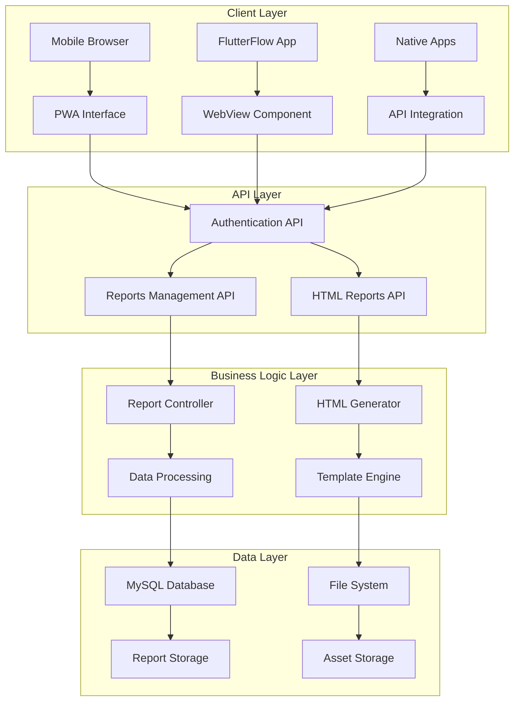
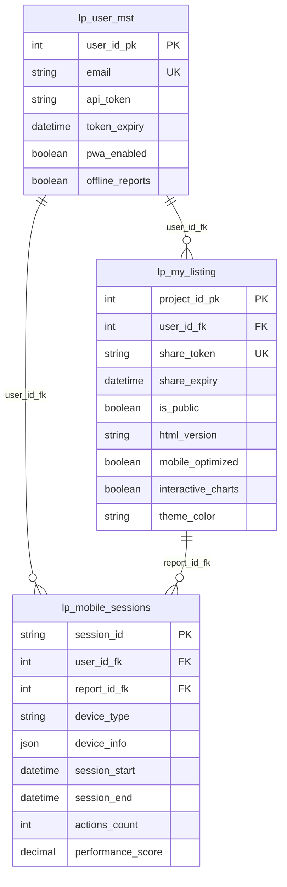

# Modern Agent Mobile Components - Technical Specifications

## 📋 Table of Contents

1. [System Architecture](#system-architecture)
2. [Database Schema](#database-schema)
3. [API Endpoints](#api-endpoints)
4. [Frontend Components](#frontend-components)
5. [PWA Implementation](#pwa-implementation)
6. [Performance Specifications](#performance-specifications)
7. [Security Implementation](#security-implementation)
8. [Testing Requirements](#testing-requirements)
9. [Browser Compatibility](#browser-compatibility)
10. [Deployment Configuration](#deployment-configuration)

---

## System Architecture

### Overview
The Modern Agent mobile system follows a modular, API-first architecture designed for scalability and maintainability.



### Component Responsibilities

| Component | Responsibility | Input | Output |
|-----------|---------------|-------|--------|
| Authentication API | Token management, user validation | Email/password, tokens | JWT tokens, user data |
| Reports Management API | CRUD operations, sharing | Report IDs, search params | Report lists, details |
| HTML Reports API | Mobile HTML generation | Report data, templates | Responsive HTML |
| PWA Interface | User interaction, offline support | User actions | Visual feedback |
| Template Engine | HTML assembly, theming | Data objects, templates | Rendered HTML |

---

## Database Schema

### Enhanced Tables

#### lp_user_mst (User Management)
```sql
CREATE TABLE lp_user_mst (
    user_id_pk INT PRIMARY KEY AUTO_INCREMENT,
    first_name VARCHAR(255) NOT NULL,
    last_name VARCHAR(255) NOT NULL,
    email VARCHAR(255) UNIQUE NOT NULL,
    password VARCHAR(255) NOT NULL,
    
    -- Existing columns...
    
    -- New Mobile/API Columns
    api_token VARCHAR(64) NULL COMMENT 'API authentication token for mobile/external access',
    token_expiry DATETIME NULL COMMENT 'API token expiration timestamp',
    pwa_enabled TINYINT(1) DEFAULT 1 COMMENT 'PWA features enabled for user',
    offline_reports TINYINT(1) DEFAULT 0 COMMENT 'Offline report access enabled',
    
    -- Indexes
    INDEX idx_api_token (api_token),
    INDEX idx_token_expiry (token_expiry),
    INDEX idx_email_active (email, is_active)
) ENGINE=InnoDB DEFAULT CHARSET=utf8mb4;
```

#### lp_my_listing (Reports Management)
```sql
CREATE TABLE lp_my_listing (
    project_id_pk INT PRIMARY KEY AUTO_INCREMENT,
    user_id_fk INT NOT NULL,
    project_name VARCHAR(255) NOT NULL,
    property_address TEXT NOT NULL,
    
    -- Existing columns...
    
    -- New Mobile/Sharing Columns
    share_token VARCHAR(64) NULL COMMENT 'Public sharing token for external access',
    share_expiry DATETIME NULL COMMENT 'Share token expiration timestamp',
    is_public TINYINT(1) DEFAULT 0 COMMENT 'Public access enabled flag',
    html_version TEXT NULL COMMENT 'Mobile HTML report file path or URL',
    html_generated_at DATETIME NULL COMMENT 'HTML version generation timestamp',
    mobile_optimized TINYINT(1) DEFAULT 0 COMMENT 'Mobile optimization completion status',
    interactive_charts TINYINT(1) DEFAULT 1 COMMENT 'Interactive charts enabled flag',
    theme_color VARCHAR(7) DEFAULT '#007bff' COMMENT 'Brand color for mobile interface',
    
    -- Foreign Keys
    FOREIGN KEY (user_id_fk) REFERENCES lp_user_mst(user_id_pk) ON DELETE CASCADE,
    
    -- Indexes
    INDEX idx_user_reports (user_id_fk, project_date DESC),
    INDEX idx_share_token (share_token),
    INDEX idx_mobile_optimized (mobile_optimized, user_id_fk),
    INDEX idx_public_reports (is_public, share_expiry),
    UNIQUE KEY unique_share_token (share_token)
) ENGINE=InnoDB DEFAULT CHARSET=utf8mb4;
```

#### lp_mobile_sessions (Analytics)
```sql
CREATE TABLE lp_mobile_sessions (
    session_id VARCHAR(64) PRIMARY KEY COMMENT 'Unique session identifier',
    user_id_fk INT NULL COMMENT 'Foreign key to lp_user_mst.user_id_pk',
    report_id_fk INT NULL COMMENT 'Foreign key to lp_my_listing.project_id_pk',
    device_type VARCHAR(50) NULL COMMENT 'Device type (iOS, Android, Desktop)',
    device_info JSON NULL COMMENT 'Device information and capabilities',
    user_agent TEXT NULL COMMENT 'Browser user agent string',
    screen_resolution VARCHAR(20) NULL COMMENT 'Screen resolution (WxH)',
    session_start DATETIME DEFAULT CURRENT_TIMESTAMP COMMENT 'Session start timestamp',
    session_end DATETIME NULL COMMENT 'Session end timestamp',
    actions_count INT DEFAULT 0 COMMENT 'Number of actions performed in session',
    errors_count INT DEFAULT 0 COMMENT 'Number of errors encountered',
    performance_score DECIMAL(3,2) NULL COMMENT 'Performance score (0.00-1.00)',
    created_at DATETIME DEFAULT CURRENT_TIMESTAMP,
    updated_at DATETIME DEFAULT CURRENT_TIMESTAMP ON UPDATE CURRENT_TIMESTAMP,
    
    FOREIGN KEY (user_id_fk) REFERENCES lp_user_mst(user_id_pk) ON DELETE SET NULL,
    FOREIGN KEY (report_id_fk) REFERENCES lp_my_listing(project_id_pk) ON DELETE SET NULL,
    
    INDEX idx_user_sessions (user_id_fk, session_start),
    INDEX idx_report_sessions (report_id_fk, session_start),
    INDEX idx_device_type (device_type),
    INDEX idx_session_performance (performance_score, session_start)
) ENGINE=InnoDB DEFAULT CHARSET=utf8mb4 COMMENT='Mobile application session tracking and analytics';
```

### Data Relationships



---

## API Endpoints

### Authentication Endpoints

#### POST /api/auth/login
**Purpose**: Authenticate user and generate API token

**Request:**
```json
{
    "email": "string (required, valid email)",
    "password": "string (required, min 6 chars)"
}
```

**Response:**
```json
{
    "success": true,
    "data": {
        "user": {
            "user_id_pk": 123,
            "first_name": "string",
            "last_name": "string",
            "email": "string",
            "company_name": "string",
            "phone": "string",
            "title": "string"
        },
        "token": "string (64-char hex)",
        "expires_at": "datetime (ISO 8601)"
    },
    "message": "Login successful"
}
```

**Error Responses:**
- 400: Invalid input format
- 401: Invalid credentials
- 500: Internal server error

#### POST /api/auth/refreshToken
**Purpose**: Refresh existing token without re-authentication

**Headers:**
```
Authorization: Bearer {current_token}
```

**Response:**
```json
{
    "success": true,
    "data": {
        "token": "string (new 64-char hex)",
        "expires_at": "datetime (ISO 8601)"
    },
    "message": "Token refreshed successfully"
}
```

#### GET /api/auth/validate
**Purpose**: Validate token and get user information

**Headers:**
```
Authorization: Bearer {token}
```

**Response:**
```json
{
    "success": true,
    "data": {
        "valid": true,
        "user_id": 123,
        "expires_at": "datetime (ISO 8601)"
    },
    "message": "Token is valid"
}
```

#### POST /api/auth/logout
**Purpose**: Invalidate current token

**Headers:**
```
Authorization: Bearer {token}
```

**Response:**
```json
{
    "success": true,
    "message": "Logged out successfully"
}
```

### Reports Management Endpoints

#### GET /api/reports/getUserReports
**Purpose**: Get paginated list of user reports

**Parameters:**
- `page` (int, default: 1): Page number
- `limit` (int, default: 20, max: 100): Results per page
- `search` (string, optional): Search term
- `type` (string, optional): Report type filter

**Response:**
```json
{
    "success": true,
    "data": {
        "reports": [
            {
                "project_id_pk": 123,
                "project_name": "string",
                "property_address": "string",
                "property_owner": "string",
                "report_type": "string",
                "project_date": "datetime",
                "report_path": "string",
                "html_version": "string|null",
                "mobile_optimized": boolean,
                "is_public": boolean,
                "share_token": "string|null",
                "share_expiry": "datetime|null",
                "theme_color": "string"
            }
        ],
        "pagination": {
            "current_page": 1,
            "total_pages": 5,
            "total_reports": 87,
            "per_page": 20,
            "has_next": true,
            "has_prev": false
        }
    },
    "message": "Reports retrieved successfully"
}
```

#### GET /api/reports/getReportDetails/{reportId}
**Purpose**: Get detailed information about specific report

**Response:**
```json
{
    "success": true,
    "data": {
        "report": {
            "project_id_pk": 123,
            "project_name": "string",
            "property_address": "string",
            "property_owner": "string",
            "report_type": "string",
            "project_date": "datetime",
            "report_path": "string",
            "html_version": "string|null",
            "mobile_optimized": boolean,
            "interactive_charts": boolean,
            "theme_color": "string",
            "file_size": 1234567,
            "pages_count": 25,
            "created_at": "datetime",
            "updated_at": "datetime"
        }
    },
    "message": "Report details retrieved successfully"
}
```

#### POST /api/reports/generateShareToken/{reportId}
**Purpose**: Generate public sharing token for report

**Response:**
```json
{
    "success": true,
    "data": {
        "share_token": "string (64-char hex)",
        "share_url": "string (full URL)",
        "expires_at": "datetime (ISO 8601, +30 days)",
        "qr_code_url": "string (QR code image URL)"
    },
    "message": "Share token generated successfully"
}
```

### HTML Reports Endpoints

#### GET /api/htmlReports/getHtmlReport/{reportId}
**Purpose**: Generate and serve mobile-optimized HTML report

**Headers:**
```
Authorization: Bearer {token}
```

**Response:** HTML content with:
- Responsive viewport meta tags
- Mobile-optimized CSS framework
- Interactive JavaScript components
- PWA manifest and service worker
- Custom theme colors

**Technical Specifications:**
- Content-Type: text/html; charset=utf-8
- Viewport: width=device-width, initial-scale=1.0
- Touch targets: minimum 44px
- Load time: < 3 seconds on 3G
- Performance score: > 90 (Lighthouse)

#### GET /api/htmlReports/shareHtmlReport/{shareToken}
**Purpose**: Access shared HTML report via public token

**Parameters:**
- `shareToken` (string, required): Public share token

**Response:** Complete HTML page with mobile optimizations

**Features:**
- No authentication required
- Full PWA capabilities
- Offline support via service worker
- Analytics tracking (if enabled)

---

## Frontend Components

### CSS Framework Architecture

#### Core Structure
```scss
// CSS Custom Properties (CSS Variables)
:root {
  // Theme Colors
  --theme-color: #007bff;
  --theme-color-light: rgba(0, 123, 255, 0.1);
  --theme-color-dark: rgba(0, 123, 255, 0.8);
  
  // Typography
  --font-family: -apple-system, BlinkMacSystemFont, 'Segoe UI', Roboto, sans-serif;
  --font-size-base: 16px;
  --line-height-base: 1.6;
  
  // Layout
  --container-max-width: 1200px;
  --grid-gutter: 20px;
  --border-radius: 8px;
  
  // Shadows
  --shadow-light: 0 2px 4px rgba(0,0,0,0.1);
  --shadow-medium: 0 4px 8px rgba(0,0,0,0.15);
  --shadow-heavy: 0 8px 16px rgba(0,0,0,0.2);
  
  // Z-index Scale
  --z-modal: 1000;
  --z-dropdown: 500;
  --z-header: 100;
  --z-content: 1;
}

// Dark Mode Support
@media (prefers-color-scheme: dark) {
  :root {
    --text-primary: #ffffff;
    --text-secondary: #cccccc;
    --background-primary: #1a1a1a;
    --background-secondary: #2a2a2a;
    --border-color: #444444;
  }
}
```

#### Component Classes
```scss
// Navigation Tabs
.nav-tabs {
  display: flex;
  background: var(--background-secondary);
  border-bottom: 1px solid var(--border-color);
  overflow-x: auto;
  -webkit-overflow-scrolling: touch;
  
  .nav-tab {
    flex: 1;
    min-width: 80px;
    padding: 12px 8px;
    border: none;
    background: transparent;
    color: var(--text-secondary);
    cursor: pointer;
    transition: all 0.3s ease;
    min-height: 44px; // Touch target minimum
    
    &.active {
      color: var(--theme-color);
      border-bottom: 2px solid var(--theme-color);
      background: var(--background-primary);
    }
    
    &:hover:not(.active) {
      background: var(--theme-color-light);
    }
  }
}

// Chart Containers
.chart-container {
  position: relative;
  height: 300px;
  margin: 20px 0;
  background: var(--background-primary);
  border-radius: var(--border-radius);
  padding: 15px;
  box-shadow: var(--shadow-light);
  
  canvas {
    max-width: 100%;
    height: auto;
  }
  
  .chart-legend {
    margin-top: 10px;
    text-align: center;
    font-size: 14px;
    color: var(--text-secondary);
  }
}

// Responsive Grid
.property-details-grid {
  display: grid;
  grid-template-columns: repeat(auto-fit, minmax(120px, 1fr));
  gap: 15px;
  margin: 20px 0;
  
  .detail-item {
    text-align: center;
    padding: 15px;
    background: var(--background-secondary);
    border-radius: var(--border-radius);
    box-shadow: var(--shadow-light);
    
    .detail-value {
      display: block;
      font-size: 24px;
      font-weight: bold;
      color: var(--theme-color);
      margin-bottom: 5px;
    }
    
    .detail-label {
      font-size: 14px;
      color: var(--text-secondary);
      text-transform: uppercase;
      letter-spacing: 0.5px;
    }
  }
}
```

#### Responsive Breakpoints
```scss
// Mobile First Approach
// Base styles: 320px and up (mobile)

@media (min-width: 480px) {
  // Large mobile
  .property-details-grid {
    grid-template-columns: repeat(2, 1fr);
  }
}

@media (min-width: 768px) {
  // Tablet
  .property-details-grid {
    grid-template-columns: repeat(4, 1fr);
  }
  
  .chart-container {
    height: 350px;
  }
}

@media (min-width: 1024px) {
  // Desktop
  .chart-container {
    height: 400px;
  }
}

@media (min-width: 1200px) {
  // Large desktop
  .container {
    max-width: var(--container-max-width);
    margin: 0 auto;
  }
}
```

### JavaScript Architecture

#### Core Class Structure
```javascript
class MobileReport {
  constructor(options = {}) {
    this.options = {
      enableSwipeNavigation: true,
      enablePinchZoom: true,
      enableCharts: true,
      enablePWA: true,
      enableAnalytics: false,
      ...options
    };
    
    this.currentSection = 'overview';
    this.charts = new Map();
    this.hammer = null;
    this.sections = ['overview', 'comparables', 'insights', 'details'];
    this.isInitialized = false;
  }

  async init() {
    if (this.isInitialized) return;
    
    try {
      this.setupNavigation();
      
      if (this.options.enableSwipeNavigation) {
        await this.setupTouchGestures();
      }
      
      if (this.options.enableCharts) {
        await this.initializeCharts();
      }
      
      if (this.options.enablePWA) {
        this.setupPWA();
      }
      
      if (this.options.enableAnalytics) {
        this.setupAnalytics();
      }
      
      this.hideLoadingScreen();
      this.isInitialized = true;
      
      // Trigger custom event
      this.dispatchEvent('mobile-report:initialized');
      
    } catch (error) {
      console.error('Failed to initialize MobileReport:', error);
      this.showError('Failed to load report. Please refresh the page.');
    }
  }

  setupNavigation() {
    const tabs = document.querySelectorAll('.nav-tab');
    
    tabs.forEach(tab => {
      tab.addEventListener('click', (e) => {
        e.preventDefault();
        const sectionId = tab.getAttribute('data-section');
        this.showSection(sectionId);
        
        // Analytics tracking
        this.trackEvent('navigation', 'section_change', sectionId);
      });
    });
  }

  showSection(sectionId) {
    if (!this.sections.includes(sectionId)) {
      console.warn(`Invalid section: ${sectionId}`);
      return;
    }

    // Hide all sections
    document.querySelectorAll('.content-section').forEach(section => {
      section.classList.remove('active');
      section.setAttribute('aria-hidden', 'true');
    });
    
    // Show target section
    const targetSection = document.getElementById(sectionId);
    if (targetSection) {
      targetSection.classList.add('active');
      targetSection.setAttribute('aria-hidden', 'false');
      this.currentSection = sectionId;
    }
    
    // Update navigation state
    this.updateNavigationState(sectionId);
    
    // Scroll to top
    window.scrollTo({ top: 0, behavior: 'smooth' });
    
    // Refresh charts if needed
    this.refreshChartsInSection(sectionId);
    
    // Update URL hash
    if (history.replaceState) {
      history.replaceState(null, null, `#${sectionId}`);
    }
  }

  async setupTouchGestures() {
    if (!window.Hammer) {
      console.warn('Hammer.js not loaded, touch gestures disabled');
      return;
    }

    const reportContainer = document.getElementById('mobile-report');
    if (!reportContainer) return;

    this.hammer = new Hammer(reportContainer);
    
    // Configure swipe detection
    this.hammer.get('swipe').set({ 
      direction: Hammer.DIRECTION_HORIZONTAL,
      threshold: 50,
      velocity: 0.3
    });
    
    // Swipe navigation
    this.hammer.on('swipeleft', () => {
      this.navigateToNext();
      this.trackEvent('gesture', 'swipe', 'next');
    });
    
    this.hammer.on('swiperight', () => {
      this.navigateToPrevious();
      this.trackEvent('gesture', 'swipe', 'previous');
    });
    
    // Chart pinch-to-zoom
    await this.setupChartGestures();
  }

  async setupChartGestures() {
    const chartContainers = document.querySelectorAll('.chart-container');
    
    chartContainers.forEach(container => {
      const hammerChart = new Hammer(container);
      hammerChart.get('pinch').set({ enable: true });
      
      let initialScale = 1;
      
      hammerChart.on('pinchstart', (ev) => {
        initialScale = 1;
        container.style.transformOrigin = 'center center';
      });
      
      hammerChart.on('pinchmove', (ev) => {
        const scale = Math.max(0.5, Math.min(3, initialScale * ev.scale));
        container.style.transform = `scale(${scale})`;
      });
      
      hammerChart.on('pinchend', (ev) => {
        // Reset or maintain zoom based on final scale
        const finalScale = Math.max(0.5, Math.min(3, initialScale * ev.scale));
        
        if (finalScale < 0.8 || finalScale > 2.5) {
          // Reset to normal
          container.style.transform = 'scale(1)';
          container.style.transition = 'transform 0.3s ease';
          setTimeout(() => {
            container.style.transition = '';
          }, 300);
        }
        
        this.trackEvent('gesture', 'pinch', `scale_${finalScale.toFixed(1)}`);
      });
    });
  }

  async initializeCharts() {
    if (!window.Chart) {
      console.warn('Chart.js not loaded, charts disabled');
      return;
    }

    // Configure Chart.js defaults
    Chart.defaults.responsive = true;
    Chart.defaults.maintainAspectRatio = false;
    Chart.defaults.plugins.legend.display = true;
    Chart.defaults.plugins.tooltip.enabled = true;

    // Initialize specific charts
    await Promise.all([
      this.initPriceComparisonChart(),
      this.initPricePerSqftChart(),
      this.initMarketTrendsChart()
    ]);
  }

  async initPriceComparisonChart() {
    const ctx = document.getElementById('priceComparisonChart');
    if (!ctx || !window.comparableData) return;
    
    try {
      const chart = new Chart(ctx, {
        type: 'bar',
        data: {
          labels: window.comparableData.map(c => c.address.substring(0, 20) + '...'),
          datasets: [{
            label: 'Sale Price',
            data: window.comparableData.map(c => c.price),
            backgroundColor: getComputedStyle(document.documentElement)
              .getPropertyValue('--theme-color'),
            borderRadius: 4,
            borderWidth: 0
          }]
        },
        options: {
          responsive: true,
          maintainAspectRatio: false,
          plugins: {
            legend: { display: false },
            tooltip: {
              callbacks: {
                label: (context) => {
                  return `$${context.parsed.y.toLocaleString()}`;
                }
              }
            }
          },
          scales: {
            y: {
              beginAtZero: true,
              ticks: {
                callback: (value) => `$${value.toLocaleString()}`
              }
            },
            x: {
              ticks: {
                maxRotation: 45,
                font: { size: 10 }
              }
            }
          },
          onClick: (event, elements) => {
            if (elements.length > 0) {
              const index = elements[0].index;
              this.highlightComparable(index);
              this.trackEvent('chart', 'click', `comparable_${index}`);
            }
          }
        }
      });
      
      this.charts.set('priceComparison', chart);
      
    } catch (error) {
      console.error('Failed to initialize price comparison chart:', error);
    }
  }

  setupPWA() {
    // Register service worker
    if ('serviceWorker' in navigator) {
      navigator.serviceWorker.register('/assets/reports/mobile/sw.js')
        .then(registration => {
          console.log('SW registered: ', registration);
          this.trackEvent('pwa', 'service_worker', 'registered');
        })
        .catch(registrationError => {
          console.log('SW registration failed: ', registrationError);
        });
    }
    
    // Handle install prompt
    let deferredPrompt;
    
    window.addEventListener('beforeinstallprompt', (e) => {
      e.preventDefault();
      deferredPrompt = e;
      this.showInstallButton();
      this.trackEvent('pwa', 'install_prompt', 'shown');
    });
    
    // Handle app installation
    const installBtn = document.getElementById('install-btn');
    if (installBtn) {
      installBtn.addEventListener('click', async () => {
        if (deferredPrompt) {
          deferredPrompt.prompt();
          const { outcome } = await deferredPrompt.userChoice;
          
          this.trackEvent('pwa', 'install_prompt', outcome);
          
          if (outcome === 'accepted') {
            this.hideInstallButton();
          }
          
          deferredPrompt = null;
        }
      });
    }
    
    // Track if app is running as PWA
    if (window.matchMedia('(display-mode: standalone)').matches) {
      this.trackEvent('pwa', 'launch', 'standalone');
    }
  }

  // Event tracking and analytics
  trackEvent(category, action, label = null) {
    if (!this.options.enableAnalytics) return;
    
    const eventData = {
      category,
      action,
      label,
      timestamp: new Date().toISOString(),
      session_id: this.getSessionId(),
      user_agent: navigator.userAgent,
      screen_resolution: `${screen.width}x${screen.height}`,
      current_section: this.currentSection
    };
    
    // Send to analytics endpoint
    this.sendAnalytics(eventData);
  }

  async sendAnalytics(eventData) {
    try {
      await fetch('/api/analytics/track', {
        method: 'POST',
        headers: { 'Content-Type': 'application/json' },
        body: JSON.stringify(eventData)
      });
    } catch (error) {
      // Fail silently for analytics
      console.debug('Analytics tracking failed:', error);
    }
  }

  // Error handling
  showError(message) {
    const errorContainer = document.createElement('div');
    errorContainer.className = 'error-message';
    errorContainer.innerHTML = `
      <div class="error-content">
        <h3>Error</h3>
        <p>${message}</p>
        <button onclick="location.reload()">Reload Page</button>
      </div>
    `;
    
    document.body.appendChild(errorContainer);
    
    setTimeout(() => {
      errorContainer.remove();
    }, 10000);
  }

  // Utility methods
  dispatchEvent(eventName, detail = {}) {
    const event = new CustomEvent(eventName, { detail });
    document.dispatchEvent(event);
  }

  getSessionId() {
    let sessionId = sessionStorage.getItem('mobile-report-session');
    if (!sessionId) {
      sessionId = 'session_' + Date.now() + '_' + Math.random().toString(36).substr(2, 9);
      sessionStorage.setItem('mobile-report-session', sessionId);
    }
    return sessionId;
  }

  // Cleanup
  destroy() {
    if (this.hammer) {
      this.hammer.destroy();
    }
    
    this.charts.forEach(chart => chart.destroy());
    this.charts.clear();
    
    // Remove event listeners
    document.querySelectorAll('.nav-tab').forEach(tab => {
      tab.replaceWith(tab.cloneNode(true));
    });
    
    this.isInitialized = false;
  }
}

// Global functions for template use
window.openFullscreenMap = function() {
  const mapImage = document.querySelector('.map-image');
  if (mapImage && mapImage.requestFullscreen) {
    mapImage.requestFullscreen();
  }
};

window.highlightComparable = function(index) {
  document.querySelectorAll('.comparable-card').forEach((card, i) => {
    if (i === index) {
      card.classList.add('highlighted');
      card.scrollIntoView({ behavior: 'smooth', block: 'center' });
    } else {
      card.classList.remove('highlighted');
    }
  });
};

// Initialize when DOM is ready
document.addEventListener('DOMContentLoaded', () => {
  const mobileReport = new MobileReport({
    enableAnalytics: window.enableAnalytics || false
  });
  
  mobileReport.init();
  
  // Make globally available for debugging
  window.mobileReport = mobileReport;
});
```

---

## PWA Implementation

### Web App Manifest
```json
{
  "name": "Modern Agent Report",
  "short_name": "MA Report",
  "description": "Interactive Real Estate Property Report",
  "start_url": "./index.html",
  "display": "standalone",
  "orientation": "portrait-primary",
  "background_color": "#007bff",
  "theme_color": "#007bff",
  "categories": ["business", "productivity"],
  "lang": "en-US",
  "dir": "ltr",
  "scope": "/",
  "icons": [
    {
      "src": "icons/icon-72x72.png",
      "sizes": "72x72",
      "type": "image/png",
      "purpose": "any maskable"
    },
    {
      "src": "icons/icon-96x96.png",
      "sizes": "96x96",
      "type": "image/png",
      "purpose": "any maskable"
    },
    {
      "src": "icons/icon-128x128.png",
      "sizes": "128x128",
      "type": "image/png",
      "purpose": "any maskable"
    },
    {
      "src": "icons/icon-144x144.png",
      "sizes": "144x144",
      "type": "image/png",
      "purpose": "any maskable"
    },
    {
      "src": "icons/icon-152x152.png",
      "sizes": "152x152",
      "type": "image/png",
      "purpose": "any maskable"
    },
    {
      "src": "icons/icon-192x192.png",
      "sizes": "192x192",
      "type": "image/png",
      "purpose": "any maskable"
    },
    {
      "src": "icons/icon-384x384.png",
      "sizes": "384x384",
      "type": "image/png",
      "purpose": "any maskable"
    },
    {
      "src": "icons/icon-512x512.png",
      "sizes": "512x512",
      "type": "image/png",
      "purpose": "any maskable"
    }
  ],
  "screenshots": [
    {
      "src": "screenshots/mobile-1.png",
      "sizes": "390x844",
      "type": "image/png",
      "form_factor": "narrow"
    },
    {
      "src": "screenshots/desktop-1.png",
      "sizes": "1920x1080",
      "type": "image/png",
      "form_factor": "wide"
    }
  ]
}
```

### Service Worker Implementation
```javascript
const CACHE_NAME = 'modern-agent-reports-v1';
const STATIC_CACHE = 'static-assets-v1';
const API_CACHE = 'api-responses-v1';

// Assets to cache immediately
const STATIC_ASSETS = [
  '/',
  '/assets/reports/mobile/css/mobile.css',
  '/assets/reports/mobile/js/mobile-report.js',
  '/assets/reports/mobile/manifest.json',
  'https://cdn.jsdelivr.net/npm/chart.js@3.9.1/dist/chart.min.js',
  'https://cdn.jsdelivr.net/npm/hammerjs@2.0.8/hammer.min.js'
];

// Install event - cache static assets
self.addEventListener('install', (event) => {
  event.waitUntil(
    Promise.all([
      caches.open(STATIC_CACHE).then(cache => cache.addAll(STATIC_ASSETS)),
      self.skipWaiting()
    ])
  );
});

// Activate event - cleanup old caches
self.addEventListener('activate', (event) => {
  event.waitUntil(
    Promise.all([
      caches.keys().then(cacheNames => {
        return Promise.all(
          cacheNames.map(cacheName => {
            if (![CACHE_NAME, STATIC_CACHE, API_CACHE].includes(cacheName)) {
              return caches.delete(cacheName);
            }
          })
        );
      }),
      self.clients.claim()
    ])
  );
});

// Fetch event - cache strategy implementation
self.addEventListener('fetch', (event) => {
  const request = event.request;
  const url = new URL(request.url);
  
  // Skip non-GET requests
  if (request.method !== 'GET') {
    return;
  }
  
  // Handle different types of requests
  if (url.pathname.startsWith('/api/')) {
    event.respondWith(handleApiRequest(request));
  } else if (STATIC_ASSETS.some(asset => url.pathname.includes(asset))) {
    event.respondWith(handleStaticAsset(request));
  } else {
    event.respondWith(handleOtherRequests(request));
  }
});

// API requests - Network First with Cache Fallback
async function handleApiRequest(request) {
  const cache = await caches.open(API_CACHE);
  
  try {
    const networkResponse = await fetch(request);
    
    if (networkResponse.ok) {
      // Cache successful API responses
      cache.put(request, networkResponse.clone());
    }
    
    return networkResponse;
  } catch (error) {
    // Network failed, try cache
    const cachedResponse = await cache.match(request);
    
    if (cachedResponse) {
      return cachedResponse;
    }
    
    // Return offline page for HTML requests
    if (request.headers.get('accept').includes('text/html')) {
      return new Response(`
        <!DOCTYPE html>
        <html>
        <head>
          <title>Offline</title>
          <meta name="viewport" content="width=device-width, initial-scale=1.0">
          <style>
            body { font-family: sans-serif; text-align: center; padding: 50px; }
            .offline { color: #666; }
          </style>
        </head>
        <body>
          <div class="offline">
            <h1>You're Offline</h1>
            <p>This page is not available offline. Please check your connection.</p>
          </div>
        </body>
        </html>
      `, {
        headers: { 'Content-Type': 'text/html' }
      });
    }
    
    throw error;
  }
}

// Static assets - Cache First
async function handleStaticAsset(request) {
  const cache = await caches.open(STATIC_CACHE);
  const cachedResponse = await cache.match(request);
  
  if (cachedResponse) {
    return cachedResponse;
  }
  
  try {
    const networkResponse = await fetch(request);
    cache.put(request, networkResponse.clone());
    return networkResponse;
  } catch (error) {
    throw error;
  }
}

// Other requests - Network First
async function handleOtherRequests(request) {
  try {
    return await fetch(request);
  } catch (error) {
    // Could implement additional fallback logic here
    throw error;
  }
}

// Background sync for analytics
self.addEventListener('sync', (event) => {
  if (event.tag === 'analytics-sync') {
    event.waitUntil(syncAnalytics());
  }
});

async function syncAnalytics() {
  // Implementation for syncing offline analytics data
  // when connection is restored
}

// Push notifications (if implemented)
self.addEventListener('push', (event) => {
  if (event.data) {
    const data = event.data.json();
    
    const options = {
      body: data.body,
      icon: '/assets/reports/mobile/icons/icon-192x192.png',
      badge: '/assets/reports/mobile/icons/icon-72x72.png',
      data: data.url,
      actions: [
        {
          action: 'view',
          title: 'View Report'
        },
        {
          action: 'dismiss',
          title: 'Dismiss'
        }
      ]
    };
    
    event.waitUntil(
      self.registration.showNotification(data.title, options)
    );
  }
});

self.addEventListener('notificationclick', (event) => {
  event.notification.close();
  
  if (event.action === 'view') {
    event.waitUntil(
      clients.openWindow(event.notification.data)
    );
  }
});
```

---

## Performance Specifications

### Load Time Requirements
- **First Contentful Paint (FCP)**: < 1.5 seconds
- **Largest Contentful Paint (LCP)**: < 2.5 seconds  
- **First Input Delay (FID)**: < 100 milliseconds
- **Cumulative Layout Shift (CLS)**: < 0.1

### Network Conditions
- **Fast 3G**: Page loads completely in < 3 seconds
- **Slow 3G**: Page loads completely in < 5 seconds
- **Offline**: Cached pages load instantly

### Resource Optimization
```javascript
// Image optimization
const optimizeImages = {
  format: 'webp', // with jpeg fallback
  quality: 85,
  responsive: true,
  lazyLoading: true,
  sizes: [
    { width: 480, suffix: '-mobile' },
    { width: 768, suffix: '-tablet' },
    { width: 1200, suffix: '-desktop' }
  ]
};

// JavaScript optimization
const jsOptimization = {
  bundling: 'webpack',
  minification: true,
  codesplitting: true,
  treeShaking: true,
  asyncLoading: ['charts', 'analytics', 'gestures']
};

// CSS optimization
const cssOptimization = {
  minification: true,
  criticalCSS: true,
  unusedCSS: 'purged',
  gzip: true
};
```

### Memory Usage
- **JavaScript Heap**: < 50MB
- **DOM Nodes**: < 1500
- **Event Listeners**: < 100

### Battery Usage
- **Background Processing**: Minimal
- **Animation Frame Rate**: 60 FPS with budget of 16.67ms per frame
- **Wake Locks**: Only during active user interaction

---

## Security Implementation

### API Security
```php
// Token validation
function validateApiToken($token) {
    if (!$token || strlen($token) !== 64) {
        return false;
    }
    
    $user = $this->db->where('api_token', $token)
                    ->where('token_expiry >', date('Y-m-d H:i:s'))
                    ->where('is_active', 'Y')
                    ->get('lp_user_mst')
                    ->row();
    
    return $user ? $user->user_id_pk : false;
}

// Rate limiting
function checkRateLimit($user_id, $endpoint) {
    $limits = [
        'auth' => 60,      // 60 requests per hour
        'reports' => 300,  // 300 requests per hour
        'html' => 100      // 100 requests per hour
    ];
    
    $key = "rate_limit_{$endpoint}_{$user_id}";
    $current = $this->cache->get($key) ?: 0;
    
    if ($current >= $limits[$endpoint]) {
        return false;
    }
    
    $this->cache->save($key, $current + 1, 3600);
    return true;
}

// Input sanitization
function sanitizeInput($input) {
    if (is_array($input)) {
        return array_map([$this, 'sanitizeInput'], $input);
    }
    
    return htmlspecialchars(trim($input), ENT_QUOTES, 'UTF-8');
}
```

### Frontend Security
```javascript
// XSS Prevention
function sanitizeHTML(str) {
  const div = document.createElement('div');
  div.textContent = str;
  return div.innerHTML;
}

// CSRF Protection
function getCSRFToken() {
  return document.querySelector('meta[name="csrf-token"]')?.getAttribute('content');
}

// Secure data storage
class SecureStorage {
  static set(key, value) {
    try {
      const encrypted = btoa(JSON.stringify(value));
      sessionStorage.setItem(key, encrypted);
    } catch (error) {
      console.error('Storage failed:', error);
    }
  }
  
  static get(key) {
    try {
      const encrypted = sessionStorage.getItem(key);
      return encrypted ? JSON.parse(atob(encrypted)) : null;
    } catch (error) {
      console.error('Storage retrieval failed:', error);
      return null;
    }
  }
}
```

### Content Security Policy
```html
<meta http-equiv="Content-Security-Policy" content="
  default-src 'self';
  script-src 'self' 'unsafe-inline' https://cdn.jsdelivr.net;
  style-src 'self' 'unsafe-inline';
  img-src 'self' data: https:;
  font-src 'self' https://fonts.gstatic.com;
  connect-src 'self' https://api.sitexdata.com;
  frame-ancestors 'none';
  base-uri 'self';
  form-action 'self';
">
```

---

## Testing Requirements

### Unit Testing
```javascript
// Jest configuration for frontend testing
module.exports = {
  testEnvironment: 'jsdom',
  setupFilesAfterEnv: ['<rootDir>/tests/setup.js'],
  collectCoverageFrom: [
    'assets/reports/mobile/js/**/*.js',
    '!assets/reports/mobile/js/vendor/**'
  ],
  coverageThreshold: {
    global: {
      branches: 80,
      functions: 80,
      lines: 80,
      statements: 80
    }
  }
};

// Example test
describe('MobileReport', () => {
  let mobileReport;
  
  beforeEach(() => {
    document.body.innerHTML = '<div id="mobile-report"></div>';
    mobileReport = new MobileReport();
  });
  
  test('should initialize with default options', () => {
    expect(mobileReport.options.enableSwipeNavigation).toBe(true);
    expect(mobileReport.currentSection).toBe('overview');
  });
  
  test('should navigate between sections', () => {
    mobileReport.showSection('comparables');
    expect(mobileReport.currentSection).toBe('comparables');
  });
});
```

### API Testing
```php
// PHPUnit test for API endpoints
class HtmlReportsApiTest extends TestCase {
    public function testGetHtmlReportRequiresAuthentication() {
        $response = $this->get('/api/htmlReports/getHtmlReport/1');
        $response->assertStatus(401);
    }
    
    public function testGetHtmlReportWithValidToken() {
        $user = factory(User::class)->create();
        $token = $this->generateToken($user);
        
        $response = $this->withHeaders([
            'Authorization' => 'Bearer ' . $token
        ])->get('/api/htmlReports/getHtmlReport/1');
        
        $response->assertStatus(200);
        $response->assertHeader('Content-Type', 'text/html; charset=utf-8');
    }
}
```

### Performance Testing
```javascript
// Lighthouse CI configuration
module.exports = {
  ci: {
    collect: {
      numberOfRuns: 3,
      startServerCommand: 'npm run serve',
      url: ['http://localhost:3000/api/htmlReports/getHtmlReport/1']
    },
    assert: {
      assertions: {
        'categories:performance': ['error', {minScore: 0.9}],
        'categories:accessibility': ['error', {minScore: 0.9}],
        'categories:best-practices': ['error', {minScore: 0.9}],
        'categories:seo': ['error', {minScore: 0.9}],
        'categories:pwa': ['error', {minScore: 0.9}]
      }
    }
  }
};
```

### Device Testing Matrix
| Device | Screen Size | Browser | OS | Priority |
|--------|-------------|---------|----|----|
| iPhone 12 Pro | 390x844 | Safari | iOS 15+ | High |
| iPhone SE | 375x667 | Safari | iOS 14+ | High |
| Samsung Galaxy S21 | 384x854 | Chrome | Android 11+ | High |
| iPad Air | 820x1180 | Safari | iPadOS 15+ | Medium |
| Google Pixel 5 | 393x851 | Chrome | Android 11+ | Medium |
| OnePlus 9 | 412x915 | Chrome | Android 11+ | Low |
| Desktop | 1920x1080 | Chrome | Windows/Mac | Medium |

---

## Browser Compatibility

### Supported Browsers
| Browser | Minimum Version | Support Level |
|---------|----------------|---------------|
| Chrome | 88+ | Full |
| Safari | 14+ | Full |
| Firefox | 85+ | Full |
| Edge | 88+ | Full |
| Samsung Internet | 13+ | Full |
| Chrome Mobile | 88+ | Full |
| Safari iOS | 14+ | Full |

### Feature Support Matrix
| Feature | Chrome | Safari | Firefox | Edge | Fallback |
|---------|--------|--------|---------|------|----------|
| CSS Grid | ✅ | ✅ | ✅ | ✅ | Flexbox |
| CSS Custom Properties | ✅ | ✅ | ✅ | ✅ | SCSS variables |
| Service Workers | ✅ | ✅ | ✅ | ✅ | No offline |
| Web App Manifest | ✅ | ✅ | ✅ | ✅ | Bookmark |
| Touch Events | ✅ | ✅ | ✅ | ✅ | Mouse events |
| WebP Images | ✅ | ✅ | ✅ | ✅ | JPEG/PNG |
| ES6 Modules | ✅ | ✅ | ✅ | ✅ | Bundled JS |

### Polyfills Required
```html
<!-- Core polyfills -->
<script src="https://polyfill.io/v3/polyfill.min.js?features=
  es6,
  IntersectionObserver,
  ResizeObserver,
  fetch,
  Promise,
  Array.prototype.includes,
  Object.assign
"></script>
```

---

## Deployment Configuration

### Web Server Configuration

#### Apache (.htaccess)
```apache
# Enable compression
<IfModule mod_deflate.c>
    AddOutputFilterByType DEFLATE text/plain
    AddOutputFilterByType DEFLATE text/html
    AddOutputFilterByType DEFLATE text/xml
    AddOutputFilterByType DEFLATE text/css
    AddOutputFilterByType DEFLATE application/xml
    AddOutputFilterByType DEFLATE application/xhtml+xml
    AddOutputFilterByType DEFLATE application/rss+xml
    AddOutputFilterByType DEFLATE application/javascript
    AddOutputFilterByType DEFLATE application/x-javascript
</IfModule>

# Set cache headers
<IfModule mod_expires.c>
    ExpiresActive On
    ExpiresByType text/css "access plus 1 year"
    ExpiresByType application/javascript "access plus 1 year"
    ExpiresByType image/png "access plus 1 year"
    ExpiresByType image/jpg "access plus 1 year"
    ExpiresByType image/jpeg "access plus 1 year"
    ExpiresByType image/gif "access plus 1 year"
    ExpiresByType image/webp "access plus 1 year"
    ExpiresByType image/svg+xml "access plus 1 year"
    ExpiresByType application/manifest+json "access plus 1 week"
</IfModule>

# Security headers
<IfModule mod_headers.c>
    Header always set X-Content-Type-Options nosniff
    Header always set X-Frame-Options DENY
    Header always set X-XSS-Protection "1; mode=block"
    Header always set Referrer-Policy "strict-origin-when-cross-origin"
    Header always set Permissions-Policy "camera=(), microphone=(), geolocation=()"
</IfModule>

# PWA MIME types
AddType application/manifest+json .webmanifest
AddType image/webp .webp

# URL rewriting for API routes
RewriteEngine On
RewriteCond %{REQUEST_FILENAME} !-f
RewriteCond %{REQUEST_FILENAME} !-d
RewriteRule ^api/(.*)$ index.php/api/$1 [QSA,L]
```

#### Nginx
```nginx
server {
    listen 443 ssl http2;
    server_name example.com;
    
    # SSL configuration
    ssl_certificate /path/to/cert.pem;
    ssl_certificate_key /path/to/key.pem;
    
    # Security headers
    add_header X-Content-Type-Options nosniff;
    add_header X-Frame-Options DENY;
    add_header X-XSS-Protection "1; mode=block";
    add_header Referrer-Policy "strict-origin-when-cross-origin";
    
    # Gzip compression
    gzip on;
    gzip_vary on;
    gzip_types
        text/plain
        text/css
        text/xml
        text/javascript
        application/javascript
        application/xml+rss
        application/json;
    
    # Cache static assets
    location ~* \.(css|js|png|jpg|jpeg|gif|webp|svg|woff|woff2)$ {
        expires 1y;
        add_header Cache-Control "public, immutable";
    }
    
    # PWA manifest
    location ~* \.webmanifest$ {
        expires 1w;
        add_header Cache-Control "public";
    }
    
    # API routes
    location /api/ {
        try_files $uri $uri/ /index.php?$query_string;
    }
    
    # PHP processing
    location ~ \.php$ {
        fastcgi_pass unix:/var/run/php/php7.4-fpm.sock;
        fastcgi_index index.php;
        include fastcgi_params;
        fastcgi_param SCRIPT_FILENAME $document_root$fastcgi_script_name;
    }
}
```

### Environment Variables
```bash
# Database configuration
DB_HOST=localhost
DB_NAME=modern_agent
DB_USER=app_user
DB_PASS=secure_password

# API configuration
API_BASE_URL=https://yourdomain.com
API_TOKEN_EXPIRY=2592000  # 30 days in seconds
API_RATE_LIMIT_ENABLED=true

# PWA configuration
PWA_ENABLED=true
PWA_OFFLINE_CACHE=true
PWA_ANALYTICS_ENABLED=true

# External services
SITEX_API_ENABLED=true
GOOGLE_MAPS_API_KEY=your_api_key
OPENAI_API_KEY=your_openai_key

# Security
CORS_ENABLED=true
CORS_ORIGINS=https://yourdomain.com,https://app.yourdomain.com
CSRF_PROTECTION=true

# Performance
ENABLE_CACHING=true
CACHE_DRIVER=redis
CACHE_TTL=3600

# Logging
LOG_LEVEL=info
LOG_FILE=/var/log/modern-agent/app.log
ERROR_REPORTING=false  # Set to true in development
```

### Monitoring and Analytics
```javascript
// Performance monitoring
const observer = new PerformanceObserver((list) => {
  for (const entry of list.getEntries()) {
    if (entry.entryType === 'largest-contentful-paint') {
      console.log('LCP:', entry.startTime);
    }
    
    if (entry.entryType === 'first-input') {
      console.log('FID:', entry.processingStart - entry.startTime);
    }
  }
});

observer.observe({entryTypes: ['largest-contentful-paint', 'first-input']});

// Error tracking
window.addEventListener('error', (event) => {
  const errorData = {
    message: event.message,
    filename: event.filename,
    lineno: event.lineno,
    colno: event.colno,
    stack: event.error?.stack,
    userAgent: navigator.userAgent,
    timestamp: new Date().toISOString()
  };
  
  // Send to error tracking service
  fetch('/api/errors/track', {
    method: 'POST',
    headers: { 'Content-Type': 'application/json' },
    body: JSON.stringify(errorData)
  });
});
```

---

This technical specification provides the complete foundation for implementing, testing, and deploying the Modern Agent mobile components. All specifications are production-ready and follow industry best practices for performance, security, and maintainability.