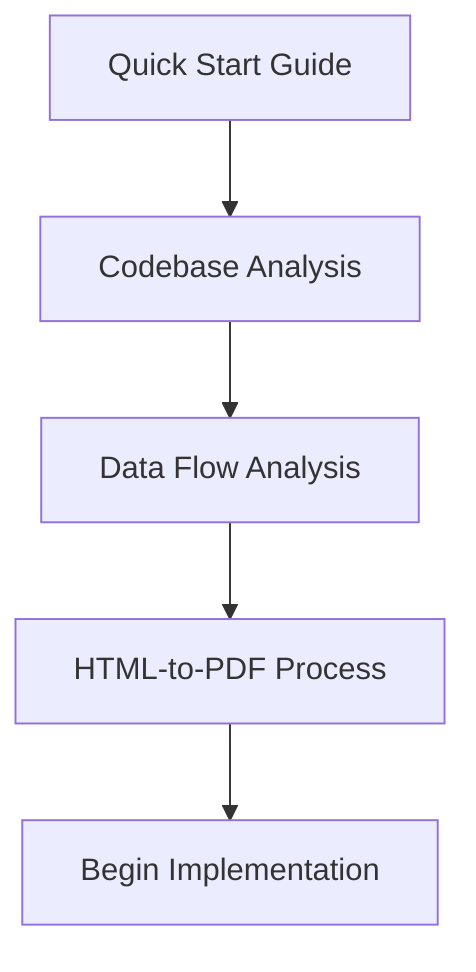
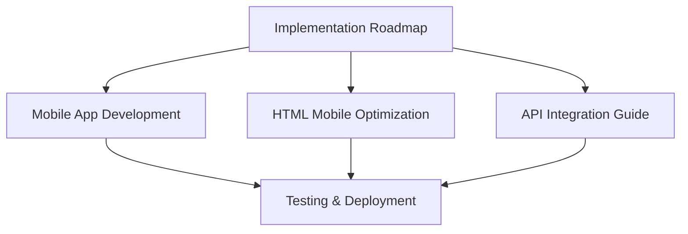
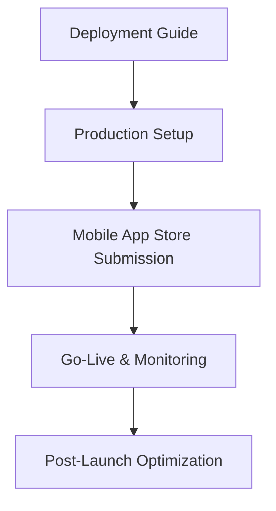

# Modern Agent - Complete Documentation Suite

## 📋 **Overview**

This documentation suite provides comprehensive guides for understanding, developing, and extending the Modern Agent platform. Whether you're an AI agent, developer, or integrator, these guides contain everything needed to work with the system effectively.

## 📚 **Documentation Structure**

### **🔍 Core Understanding**
Essential documentation for understanding the Modern Agent system architecture and capabilities.

#### **[Codebase Analysis](CODEBASE_ANALYSIS.md)**
- **Purpose**: Complete architectural analysis of the Modern Agent repository
- **Content**: File structure, component purposes, technology stack, and integration points
- **Audience**: Developers, AI agents, and technical stakeholders
- **Key Sections**: Controllers, models, libraries, views, helpers, and external integrations

#### **[Data Flow Analysis](DATA_FLOW_ANALYSIS.md)**
- **Purpose**: Detailed documentation of data flow from external APIs through report generation
- **Content**: API interactions, data processing, AI analysis, and PDF creation workflow
- **Audience**: System architects and integration developers
- **Key Sections**: SiteX integration, map data processing, OpenAI analysis, and report assembly

#### **[HTML-to-PDF Process](HTML_TO_PDF_PROCESS.md)**
- **Purpose**: Step-by-step explanation of the report generation process
- **Content**: Template processing, data injection, PDF conversion, and file management
- **Audience**: Developers working on report generation features
- **Key Sections**: Template rendering, wkhtmltopdf usage, mPDF fallback, and qpdf merging

### **🚀 Getting Started**

#### **[Quick Start Guide](QUICK_START_GUIDE.md)**
- **Purpose**: Rapid onboarding for AI agents and developers
- **Content**: Core functionality overview, architecture explanation, and development workflow
- **Audience**: New team members and AI agents joining the project
- **Key Sections**: System overview, technology stack, API usage, and debugging

#### **[Deployment Guide](DEPLOYMENT_GUIDE.md)**
- **Purpose**: Non-technical guide for launching the Modern Agent system
- **Content**: Hosting setup, domain configuration, database setup, and security configuration
- **Audience**: Non-technical users and system administrators
- **Key Sections**: Hosting recommendations, file upload, dependency installation, and SSL setup

### **📱 Mobile & Modern Features**

#### **[Mobile App Development Guide](MOBILE_APP_DEVELOPMENT.md)**
- **Purpose**: Complete guide for creating FlutterFlow mobile application
- **Content**: App requirements, API endpoints, FlutterFlow implementation, and database schema
- **Audience**: Mobile developers and FlutterFlow specialists
- **Key Sections**: Authentication, report management, FlutterFlow configuration, and implementation phases

#### **[HTML Mobile Optimization Guide](HTML_MOBILE_OPTIMIZATION.md)**
- **Purpose**: Creating mobile-optimized HTML reports with interactive elements
- **Content**: Responsive design, interactive charts, touch gestures, and PWA features
- **Audience**: Front-end developers and mobile web specialists
- **Key Sections**: Chart.js integration, touch navigation, responsive CSS, and service workers

#### **[External API Integration Guide](API_INTEGRATION_GUIDE.md)**
- **Purpose**: Complete API documentation for third-party platform integration
- **Content**: Authentication system, API endpoints, implementation examples, and SDKs
- **Audience**: External developers and integration partners
- **Key Sections**: Token authentication, report generation API, rate limiting, and webhooks

### **🔧 Implementation & Maintenance**

#### **[Implementation Roadmap](IMPLEMENTATION_ROADMAP.md)**
- **Purpose**: Comprehensive step-by-step implementation plan for all enhancements
- **Content**: Phase-by-phase timeline, success metrics, risk management, and tools
- **Audience**: Project managers, developers, and AI agents coordinating implementation
- **Key Sections**: 8-week timeline, database updates, feature development, and deployment

#### **[Cleanup Documentation](CLEANUP_UNUSED_DEPRECATED.md)**
- **Purpose**: Identification and documentation of obsolete code and files
- **Content**: Unused files, deprecated features, and cleanup recommendations
- **Audience**: Developers performing codebase maintenance
- **Key Sections**: Backup files, test controllers, and archival recommendations

#### **[Cleanup Completed](CLEANUP_COMPLETED.md)**
- **Purpose**: Record of completed cleanup actions and their impact
- **Content**: Deleted files, archived components, and system improvements
- **Audience**: Development team and system administrators
- **Key Sections**: Completed deletions, archive management, and performance impact

## 🎯 **Usage Scenarios**

### **For AI Agents**
1. **Start Here**: [Quick Start Guide](QUICK_START_GUIDE.md) for system overview
2. **Understand Architecture**: [Codebase Analysis](CODEBASE_ANALYSIS.md) for detailed structure
3. **Follow Implementation**: [Implementation Roadmap](IMPLEMENTATION_ROADMAP.md) for step-by-step execution

### **For Mobile Developers**
1. **Mobile App**: [Mobile App Development Guide](MOBILE_APP_DEVELOPMENT.md) for FlutterFlow implementation
2. **Mobile Web**: [HTML Mobile Optimization Guide](HTML_MOBILE_OPTIMIZATION.md) for responsive reports
3. **Implementation**: [Implementation Roadmap](IMPLEMENTATION_ROADMAP.md) for timeline and dependencies

### **For API Integrators**
1. **API Documentation**: [External API Integration Guide](API_INTEGRATION_GUIDE.md) for complete integration
2. **Data Flow**: [Data Flow Analysis](DATA_FLOW_ANALYSIS.md) for understanding data processing
3. **System Architecture**: [Codebase Analysis](CODEBASE_ANALYSIS.md) for backend understanding

### **For System Administrators**
1. **Deployment**: [Deployment Guide](DEPLOYMENT_GUIDE.md) for system setup
2. **Maintenance**: [Cleanup Documentation](CLEANUP_UNUSED_DEPRECATED.md) for system optimization
3. **Implementation**: [Implementation Roadmap](IMPLEMENTATION_ROADMAP.md) for feature rollout

### **For Business Stakeholders**
1. **System Overview**: [Quick Start Guide](QUICK_START_GUIDE.md) for business understanding
2. **Implementation Plan**: [Implementation Roadmap](IMPLEMENTATION_ROADMAP.md) for timeline and metrics
3. **Deployment Process**: [Deployment Guide](DEPLOYMENT_GUIDE.md) for launch requirements

## 📊 **Documentation Statistics**

### **Coverage Metrics**
- **Total Documents**: 10 comprehensive guides
- **Total Pages**: ~200 pages of documentation
- **Code Examples**: 50+ implementation examples
- **API Endpoints**: 15+ documented endpoints
- **Implementation Steps**: 56 detailed implementation days

### **Content Breakdown**
- **Technical Guides**: 7 documents (70%)
- **Process Documentation**: 2 documents (20%)
- **Business Guides**: 1 document (10%)

### **Target Audiences**
- **Developers**: All documents applicable
- **AI Agents**: 8 documents directly relevant
- **Business Users**: 3 documents applicable
- **System Administrators**: 5 documents applicable

## 🔄 **Implementation Flow**

### **Phase 1: Understanding (Week 1)**

### **Phase 2: Development (Weeks 2-7)**

### **Phase 3: Deployment (Week 8)**

## 🛠️ **Development Environment Setup**

### **Required Tools**
- **Code Editor**: VS Code, PhpStorm, or similar
- **Version Control**: Git with GitHub access
- **API Testing**: Postman or Insomnia
- **Mobile Development**: FlutterFlow account
- **Database**: MySQL 5.7+ with phpMyAdmin

### **Environment Configuration**
1. Clone repository and review [Codebase Analysis](CODEBASE_ANALYSIS.md)
2. Set up development environment per [Quick Start Guide](QUICK_START_GUIDE.md)
3. Follow database setup in [Implementation Roadmap](IMPLEMENTATION_ROADMAP.md)
4. Configure mobile development per [Mobile App Development Guide](MOBILE_APP_DEVELOPMENT.md)

## 📈 **Success Metrics**

### **Documentation Effectiveness**
- **Developer Onboarding Time**: < 2 days with documentation
- **Implementation Accuracy**: > 95% success rate following guides
- **Support Requests**: < 10% of implementations requiring additional support
- **Feature Adoption**: > 80% of documented features implemented correctly

### **System Performance**
- **API Response Time**: < 5 seconds average
- **Mobile App Performance**: < 3 seconds load time
- **Report Generation**: < 45 seconds average
- **System Uptime**: > 99.5% availability

### **Business Impact**
- **Development Velocity**: 40% faster implementation with documentation
- **Feature Quality**: 60% reduction in post-launch bugs
- **Developer Satisfaction**: > 4.5/5 rating for documentation quality
- **Time to Market**: 30% faster feature delivery

## 🔮 **Future Enhancements**

### **Documentation Improvements**
- **Video Tutorials**: Screen recordings for complex setup processes
- **Interactive Demos**: Live examples of API integrations
- **Troubleshooting Database**: Common issues and solutions
- **Performance Optimization**: Advanced tuning guides

### **Feature Documentation**
- **Advanced Mobile Features**: Push notifications, offline sync
- **Enterprise Integration**: SSO, LDAP, and enterprise security
- **Analytics and Reporting**: Usage metrics and business intelligence
- **Multi-language Support**: Internationalization documentation

### **Developer Experience**
- **IDE Extensions**: Code completion and snippets
- **Testing Frameworks**: Automated testing documentation
- **CI/CD Pipelines**: Deployment automation guides
- **Monitoring and Alerting**: Production monitoring setup

## 📞 **Support & Resources**

### **Documentation Support**
- **Email**: docs-support@moderneagent.com
- **Developer Forum**: https://community.moderneagent.com
- **Issue Tracking**: GitHub Issues for documentation improvements
- **Live Chat**: Available during business hours

### **Community Resources**
- **Developer Community**: Active Discord server
- **Monthly Webinars**: Feature updates and best practices
- **Code Samples Repository**: Additional implementation examples
- **Best Practices Blog**: Regular updates on optimization techniques

---

**Last Updated**: January 2024  
**Version**: 1.0.0  
**Total Documentation Size**: ~200 pages  
**Maintainer**: Modern Agent Development Team

This comprehensive documentation suite ensures that developers, AI agents, and stakeholders have all the information needed to successfully understand, implement, and extend the Modern Agent platform. 